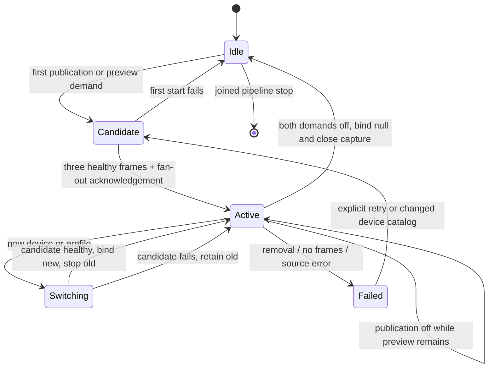
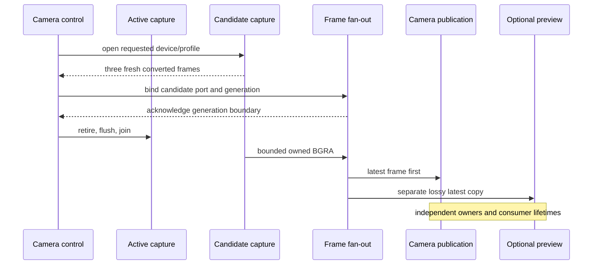
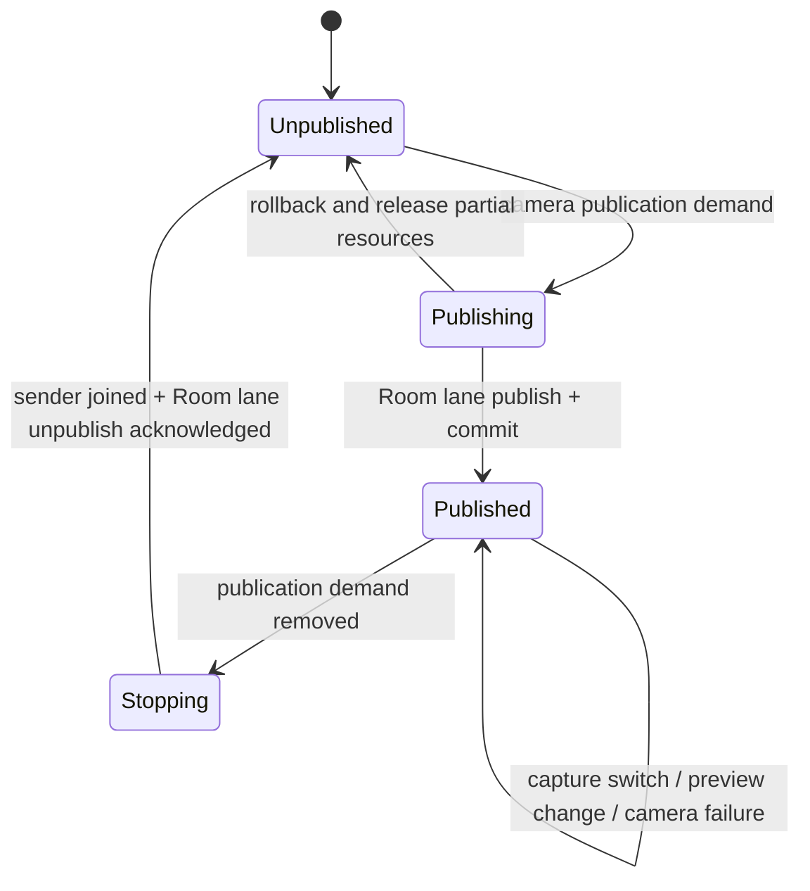

# Independent camera pipeline (#129)

The camera has one asynchronous Media Foundation capture, one publication owner
and an optional preview worker. The native owners are usable independently of
microphone and screen. Client intent/UI integration belongs to #130.

On 2026-09-08 the user waived physical-camera and physical USB unplug/replug
checks because no physical camera was available, and requested simulation where
possible. Synthetic runs below are simulation evidence, not physical acceptance.
The installed Windows virtual Pixel 9 camera was tested through the real MF
adapter: 720p30 produced 93 frames over the start proof plus three seconds;
1080p30 returned `unsupported_profile` before `running`. Both paths stopped.

## Registry and capture

`CameraDeviceRegistry` owns at most 64 present endpoints and 256 lifetime opaque
identities. Identity uses the MF symbolic link, never only a display label.
Raw activation/COM objects do not escape the Windows adapter. Refresh projects
added, removed, availability and application-default changes. The application
default is the lowest available stable ID: Windows has no MMDevice-style default
video role. An explicit missing ID does not fall back to a different camera.
Notification callbacks coalesce changes into an atomic flag; the control owner
refreshes and reconciles. Device failure also arrives from the capture path.

Classification uses Windows metadata: a software source or `SWD` enumerator is
virtual; otherwise USB bus metadata identifies `physical_usb`, ACPI identifies
`integrated`, and insufficient metadata stays `unknown`. There is no vendor list.

The capture worker owns its MTA, MF startup, source, asynchronous Source Reader
and callback. Exactly one `ReadSample` may be outstanding. The callback takes one
sample reference, stamps receipt time, signals an event and returns. It does not
convert pixels or invoke publication/preview. The worker converts and releases
the sample before admitting a copied frame to the latest-frame port.

Requests support 1280×720@30 and 1920×1080@30. Negotiation checks native dimensions
and nominal frame rate, permits approximately 29.97 as 30, and verifies the
selected output dimensions/rate. A lower profile requires explicit
`allow_downgrade`; an unsupported exact request fails before `running`.
MF decodes MJPEG where its converters support it. Checked conversion handles
BGRA/RGB32, NV12 and YUY2, including packed bottom-up stride and explicit BT.601
or BT.709 YUV conversion. Buffer count, buffer length, row bounds, dimensions and
signed arithmetic are checked before access. Frames never exceed 1920×1080 BGRA.

Three fresh converted frames establish health. No-frame progress for two seconds
is terminal for that capture. Removal, source failure, changed format, malformed
samples and unsupported capability have separate typed failures.

## Ownership and bounds

| Resource | Owner | Bound and release |
| --- | --- | --- |
| Registry apartment, activation enumeration, notifications | Control-thread Windows adapter | 64 endpoints; unregister and release before apartment teardown |
| Native endpoint identity values | Registry and candidate | 256 historical IDs; no COM pointers |
| Source, Source Reader, callback | One capture worker | One active capture plus at most one candidate; finite flush and callback-destruction proof |
| Pending MF sample | Callback completion state, then capture worker | One reference; release after checked conversion, before fan-out |
| Conversion scratch and capture output | Each capture | One 8,294,400-byte scratch plus one fixed latest BGRA frame |
| Fan-out scratch | Pipeline worker | One 8,294,400-byte buffer; publication offered first |
| Publication and preview input ports | Pipeline | One fixed latest BGRA copy each; independent consumers |
| SDK source, track, participant references | CameraPublication via Room control lane | One published camera track; one sender; unpublish before releasing references |
| SDK input frame and copy scratch | Camera sender worker | At most one current 1080p BGRA frame and scratch; profile changes replace the frame |
| Preview scaling scratch | Preview worker | One fixed input scratch plus 640×360 BGRA scratch; released on joined stop |
| Preview textures, handles and queries | Preview state retained by exported leases | Two slots, 983,040 accounted bytes each; retained leases stay counted after stop |
| Optional GPU preview partition | Process atomic budget shared with screen preview | 8 MiB total; never borrows publication/remote receive reserves |

The frame ports preallocate one frame and use one `atomic_flag` try-operation on
both sides. Contention drops a frame; no producer waits for a consumer. A new
generation clears old pending data. Receipt age is preserved through all copies;
frames older than 150 ms are dropped, including immediately before SDK admission.
The sender serializes SDK calls, so a device/profile transition cannot submit new
then old generations. An SDK call already in flight finishes before the next
generation is submitted. No MF sample survives into SDK or renderer ownership.

Preview downsamples on its own worker and uploads to two shared BGRA textures.
It only tries the process D3D11 context mutex; it never waits for capture or
publication. GPU event queries are polled without a blocking GPU wait. No progress
for 500 ms quarantines that slot and reports `gpu_stalled`. Allocation pressure,
GPU failure and a consumer holding a keyed mutex have separate preview failures.
A consumer opens the NT handle, acquires key 1 and releases key 0 before releasing
the move-only lease. An unopened lease can also be returned. Held leases retain
their exact backing across generation changes and owner stop; the last lease
returns its reservation. A stalled consumer consumes at most the two slots.
Turning preview demand off also releases free textures without requiring the
preview owner or the shared capture to restart. Held leases remain counted.
If a consumer returns a lease while still owning its keyed mutex, or a GPU fence
cannot complete before the stop deadline, that allocation's global reservation
is conservatively quarantined until process restart. Recreating a preview cannot
reuse an unproven reservation and accumulate exported textures indefinitely.

## Lifecycle







Capture start has a four-second deadline. Stop retires output immediately, flushes
an outstanding asynchronous request with a two-second deadline, releases the
reader/source, verifies callback destruction and joins the worker. Source Reader
normally calls source shutdown on release; a subsequent `MF_E_SHUTDOWN` is already
closed, not a cleanup failure. This follows the documented
[Source Reader shutdown ownership](https://learn.microsoft.com/en-us/windows/win32/medfound/mf-source-reader-disconnect-mediasource-on-shutdown)
and [asynchronous flush completion](https://learn.microsoft.com/en-us/windows/win32/api/mfreadwrite/nf-mfreadwrite-imfsourcereader-flush).

The outer utility-process kill boundary remains necessary for a driver that
blocks inside a Windows call. Owners never detach an unjoined worker or pretend
that a deadline proves resource destruction. Failed finite cleanup returns a
typed timeout; destruction without completed cleanup terminates the disposable
process. Camera errors do not call Room reconnect or microphone/screen controls.

## Verification and reproduction

`camera_tests` covers format bounds, color conversion, latest-frame contention,
age/generation rejection, registry identity, failed/healthy candidates, 100
preview toggles, preview-only and no-demand behavior, delayed conversion, pending
sample cancellation, late callbacks and typed loss. Its test-only asynchronous
reader has a separate callback thread and counts live readers and samples.
`camera_tests --preview` imports the real GPU texture and checks its pixels,
holds both slots, switches generations, stops with a live lease and competes
with screen preview for the shared budget. It carries `requires-gpu-video` for
the known hosted-runner hardware boundary. The existing screen preview regression
test also passes with the shared budget.

The test-only `camera_lab` supports:

```powershell
camera_lab.exe devices
camera_lab.exe physical 1
camera_lab.exe physical-switch 1
camera_lab.exe cycles 50
camera_lab.exe publication-failure
```

The `physical` command means a real MF device ID; its report records the detected
kind, so a virtual device is never relabeled physical. The missing-Room publication
test verifies ten rollbacks without a committed camera track or a restarted
capture. Cycle tests include three warm-up cycles before measuring fifty cycles.

The neutral observer uses stock `@livekit/rtc-node`, a separate process and a
loopback SFU. It decodes sequence, generation and capture-time barcodes from the
received pixels, verifies actual 720/1080/720 dimensions, tracks subscriptions,
and checks age/order/continuity. The publisher includes publication-only, preview,
held preview, 100 toggles, successful switch, failed candidate rollback and
simulated removal/recovery. These operations retain one camera publication and
the same Room. Physical unplug remains waived and unverified.

```powershell
$env:MEDIA_LAB_SERVER_EXE = '<absolute path to isolated LiveKit server>'
$env:MEDIA_LAB_CAMERA_EXE = '<absolute path to camera_lab.exe>'
$env:MEDIA_LAB_CAMERA_REPORT = '<absolute output report path>'
$env:MEDIA_LAB_CAMERA_SECONDS = '26' # or 1800 for the required soak
pnpm --filter @syrnike13/native-media-lab build
node packages/native-media-lab/dist/run-camera-lab.js
```

The harness creates disposable loopback credentials and binds only ports
7890–7892 on localhost. Report files contain no access tokens. It requires at least
24 fps during the fully held-preview interval, at most 500 ms age in that interval,
overall p95 age at most 250 ms and no gap longer than one second. The local
26-second run passed with 30 fps during stalled preview and 28 ms maximum age
there. The preceding profile run decoded all 777 frames with no generation
regression, one subscribe/unsubscribe, no reconnect, 38 ms p95 age and 61 ms
maximum gap. No camera SDK extension was necessary.

The updated run including simulated removal/recovery decoded 776 changing frames
with no regression, 36 ms p95 age and 140 ms maximum gap. The synthetic reader's
pixel generation counts successful opens, while the pipeline generation also
counts failed candidates; both are monotonic but intentionally different IDs.

Local Release and Debug/AddressSanitizer contract, GPU, quarantine and screen
preview regression tests pass. Debug/ASan also passes the real virtual-camera
capability rows and ten missing-Room publication rollbacks. The initial ASan test
launch omitted the compiler runtime from PATH and timed out before execution;
with that child-process runtime path supplied, all tests execute and pass.

Evidence: [observer](camera-observer-development.json),
[publication phases and stalled-preview budget](camera-publication-development.json),
[50 cycles](camera-cycles-development.json),
[native/ASan and hardware rows](camera-validation-development.json).

The [30-minute synthetic publication soak](camera-soak-development.json) passed:
54,000 submitted / 53,996 independently decoded changing frames, one camera
subscription and unsubscription, no reconnect or generation regression, 30 ms
p95 age, 88 ms maximum age and 139 ms maximum gap. Fully held preview retained
30 fps with at most 27 ms age. After the first ten minutes, private bytes stayed
within 177,053,696–178,921,472, handles 707–726 and threads 56–59. One reader and
at most one sample remained live, and preview stayed at 1,966,080 bytes. Teardown
released every reader, sample and preview reservation. This is development-SDK
evidence; the final published-SDK smoke run is recorded separately.

## Published SDK verification

The normal `build:lab` uses the same hash-pinned `v1.10.0-syrnike.14` dependency
as #128, with `WINDOWS_MEDIA_LIVEKIT_SDK_ROOT=OFF`. Both SDK DLLs match the
published archive. Artifact verification and all 37 native tests passed in
118.38 seconds, including eight GPU tests. The final preview-off and quarantine
regressions also pass under Debug/ASan.

The [published-SDK observer](camera-observer-release14.json) verifies the actual
`SOURCE_CAMERA` publication, profile changes and removal/recovery with no
generation regression. Its [publication report](camera-publication-release14.json)
measures 30 fps and at most 28 ms age during fully held preview. The real virtual
device's `physical-switch 1` row also passes: the unsupported 1080p candidate
leaves generation 1 running, advancing from 3 to 64 frames before safe stop.

The observer records SFU terminal VP8 reset frames separately. The project's
`DownTrack.CloseWithFlush` deliberately sends 8×8 keyframes to clear a receiver's
decoder. They are accepted only next to unsubscription, after the publisher's
recorded stop phase, and with no subsequent camera frames. An 8×8 reset during
normal streaming still fails. One initial release run received a frame smaller
than the barcode at unpublish; the SFU reset path explains that observation,
although that run did not record its dimensions. The four final runs did not
receive reset frames, so they verify normal teardown, not that optional branch.

A repeated release run also exposed a final preview GPU event query that stayed
`S_FALSE` with `DONOTFLUSH` polling after capture stopped. Camera now uses the
same flushing poll as screen preview and releases the producer keyed mutex
before clearing completed retired work. Four subsequent 26-second publication
runs passed with zero retained preview reservation, 38–42 ms p95 age and at most
139 ms receive gap. The native GPU test additionally stops immediately after
submission twenty times without a consumer; Release and Debug/ASan both pass.
Preview-off also clears reusable textures from the retired generation.
