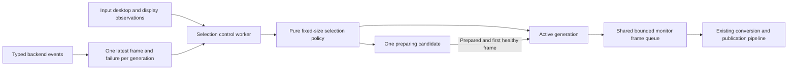
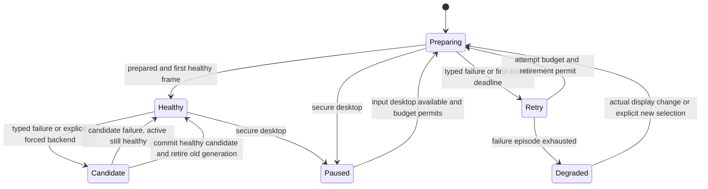

# Monitor backend selection

Issue #126 adds monitor-only DXGI Desktop Duplication behind the existing frame
lease contract. WGC remains the default. Window capture remains WGC-only.
The selecting owner contains no LiveKit, encoder, preview or Electron methods.
The lab exercises selection inside one production screen pipeline/publication.

## Ownership

Backend preparation and stop run on generation workers. A slow candidate cannot
block delivery from a healthy active backend. Callbacks only fill bounded
mailboxes; the control worker alone commits a generation. Generation identity is
preserved through `MonitorCapture` into frame metadata. Retiring a generation
fences its callbacks and prevents another attempt until its worker and external
frame leases drain. A stop deadline failure requires utility retirement.
The converter releases each input view after submitting that frame: cached
COM views otherwise retain old capture textures even after frame leases drain,
including when no next frame is converted after a switch or stop.
The processor and NV12 output pool remain reusable when dimensions are unchanged.

No-content observations do not cause recovery. Display changes alone do not
replace a healthy backend; a typed API failure initiates recovery. Output loss
and device removal remain degraded until a real display change or explicit
selection permits another attempt. A display watcher runs separately from frame
delivery and observes input desktop identity, mode/topology and advanced-color
state. Unsupported/transient HDR queries retain the last known HDR revision.
The environment worker also revalidates the selected source identity. Explicit
absence from the active topology terminates that capture generation and waits
for source availability; it does not depend on WGC sending `Closed`. An inactive
monitor's cached capture item is evicted during stop. The shared cache holds one
MTA usage reference so its WinRT objects cannot outlive the COM runtime when a
generation worker exits. Weak, generation-fenced cache callbacks permit orderly
cache destruction before releasing that reference.

The WGC window callback also checks the actual window visibility before using
frame geometry. WGC can emit minimized-window dimensions before the 25 ms
observer notices the transition. Such frames are drained without pool resize,
generation creation or delivery. The window fixture gates an already-arrived
callback, minimizes the window, then releases it and requires no resize/delivery
work until restoration. This regression also runs under AddressSanitizer.

Scripted owner tests cover an HDR revision while healthy, an unavailable HDR
query while degraded, and recovery after a subsequent real revision. The
hardware evidence covers resolution, refresh, rotation and output removal;
it does not claim a physical HDR-mode toggle on this machine.

## Hard limits

| Resource or transition | Bound |
| --- | --- |
| Live capture generations, including retirement | 2 |
| Candidate generations | 1 |
| First healthy candidate frame | 3 seconds |
| Consecutive failed attempts in an episode | 3 |
| Attempts in a rolling minute | 6 |
| Minimum spacing between attempts | 1 second |
| Generation stop deadline | 3 seconds, capped by caller deadline |
| Shared monitor frames, queued and leased | 3 |
| DXGI owned slots | 3 |
| DXGI textures per generation | 6 desktop/output textures and 1 cursor texture |
| Cursor buffer / dimensions | 1 MiB / 512 × 512 |
| Measured duplication-frame hold budget | 50 milliseconds |

The acquire/copy/release path does not wait for the statistics mutex: acquired
and released counters are published together after `ReleaseFrame` returns.
Diagnostics retain the before-copy, copy and release durations of the single
maximum-hold frame. These are wall-clock observations, including scheduling and
driver-call latency, rather than a cancellable deadline on the Windows API.
Two rejected hardware runs reached 97.9 ms during output removal and 95.9 ms
under contention. Their causes remain unresolved; a later instrumented
contention run reached 9.6 ms, almost entirely in `ReleaseFrame`. A passing
rerun does not explain those failures or establish a fix. The 50 ms gate remains
unchanged, and full acceptance remains pending.

An explicit selection starts a new failure episode but cannot reset the rolling
attempt budget. Retained frames keep their slot pool alive and remain included
in generation accounting until released.

## DXGI acquisition and composition

The selected monitor must belong to the existing D3D11 device's adapter. An
adapter mismatch reports `unsupported`; it does not capture another output or
create a cross-adapter CPU copy path.

The worker reserves an owned slot and obtains the immediate-context lock before
calling nonblocking `AcquireNextFrame`. It copies the desktop into that slot,
reads bounded pointer metadata and calls `ReleaseFrame`. Cursor decoding,
rotation/composition and all downstream work happen after release. The measured
hold interval includes `ReleaseFrame` itself, and every successful acquisition
has exactly one release even on failure paths.

The compositor uses a GPU shader for all four rotations and color, masked-color
and monochrome AND/XOR pointers. DXGI pointer position is the shape's top-left;
the hotspot is not subtracted again. Readback is opt-in for controlled tests.
The duplication mode reports oriented desktop dimensions, while acquired
textures remain unrotated. Portrait modes therefore reverse the allocation
width and height before shader rotation. Real 1920 × 1080 ↔ 1080 × 1920
transitions verify this boundary in addition to the small compositor goldens.
Offscreen commands are submitted with asynchronous `Flush`; no GPU wait is
introduced into the capture hold interval. Video-processor automatic image
enhancement is disabled for deterministic conversion.

The pipeline also preserves encoded reference continuity: after discarding a
frame beyond the existing 150 ms age limit, it suppresses dependent frames until
a fresh keyframe. The existing bounded keyframe controller requests recovery.
Publishing dependent frames immediately after a reference drop can corrupt
decoded pixels, including the laboratory timestamp marker. Separate stale and
dependent-drop counters make this recovery visible in the report.

## Reproducing verification

The normal CTest suite includes pure policy replay, concurrent selecting-owner
lifecycle, actual DXGI duplication, pixel goldens for cursor/rotation and cadence
checks. GPU tests retain the `requires-gpu-video` label and must also run on a
Windows GPU machine; hosted CI cannot supply that coverage.

The native media lab accepts `MEDIA_LAB_SCREEN_MODE`:

- `screen-gpu-monitor-1080p60`: forced WGC for 120 seconds.
- `screen-gpu-dxgi-monitor-1080p60`: forced DXGI for 120 seconds.
- `screen-gpu-switch-monitor-1080p60`: 30 switches over 375 seconds.
- `screen-gpu-dxgi-contention-monitor-1080p60`: alternating GPU load for 60 seconds.

The independent observer and backend evidence verifier both must accept a run.
The latter checks measured 1080p cadence/age, publication counts, Room continuity,
duplication hold/release accounting and settled same-backend resource samples.
Resource growth is the greatest increase over any preceding settled minimum,
bounded at 16 handles and 4 threads. A declining worker pool is not classified
as growth, while a later rebound is still checked against the lower baseline.
Warmup is explicitly separate: a 10-second publication must decode at least 80
frames, then its video track is unpublished. One companion audio publication
remains subscribed across both stages. The measured video publication reuses that
Room and transport so the bandwidth estimate is not discarded. Backend metrics
are taken only after the final `BACKEND_BEGIN` marker, and the 150 ms p95 gate
uses every frame of the measured publication. Per-publication p95 and the global
latency statistics (including the cold warmup) both remain in the observer report.

When the lab launches a native SFU executable, `MEDIA_LAB_SERVER_IP` must name
an IPv4 address assigned to the intended local interface. Signaling binds
loopback while ICE advertises that address and the UDP mux listens on
that same address. Previously `node_ip: 127.0.0.1` rewrote candidates to
loopback while the native UDP mux only listened on other interfaces. A real
socket probe reproduced the missing advertised listener. A loopback-only ICE
configuration also failed the client connection preflight, so the lab uses an
actual local IPv4 interface. Automatic selection of the first interface was
also rejected: on this host it selected `xray-tun`, and RTC diagnostics showed
candidate-pair changes. Select the intended Ethernet/Wi-Fi address explicitly;
the lab validates that it is locally assigned and non-loopback. Docker keeps its separate published-port NAT
configuration. Reconnect runs from the previous native configuration are
retained as rejected evidence.

The native fixture also enables the project SFU's embedded UDP TURN/STUN on
port 3478 of that same interface, with a fixed 30000–30100 relay-port range.
Room-scoped credentials are generated by the SFU; the fixture uses a one-hour
credential lifetime to cover the longer soak cases. Private relay peers are
restricted to the selected SFU address. This replaces the SFU's implicit public
STUN fallback, which an empty `stun_servers` list does not disable. No VPN,
adapter, routing or firewall settings are changed. The server and its generated
configuration belong to the existing lab cleanup scope.

The moving desktop fixture uses one private high-resolution waitable timer at
8 ms to supply content faster than the 60 fps capture target. Coalesced
`WM_TIMER` callbacks can undersupply this test even with a nominal 10 ms
interval. Static fixtures allocate no animation timer. This changes neither
the system-wide timer resolution nor the production capture clock.

Capture sequence gaps are expected when source frames are paced down to the
selected encoder rate. These scenarios require a cumulative decoded frame
count, measured cadence and observation duration, rather than thousands of
consecutive capture sequence numbers. Reversed sequences, invalid timestamps
and excessive frame age still reject the observer run. Marker bits are read by
majority over each tile's central 5 × 5 pixels, without temporal prediction or
timestamp repair. Bounded center-versus-area diagnostics expose sampling
disagreements in the evidence.

`backend_capture_lab wgc|dxgi` captures a static fullscreen fixture for 65 seconds.
`backend_transition_lab wgc|dxgi monitor-index duration-seconds` records real
desktop transition metadata without saving captured pixels. A successful drain
alone does not prove a transition occurred. `display_mode_proof` temporarily
changes resolution, refresh rate or rotation on a non-primary display, tests the
mode first and restores the original mode on completion. Its `disconnect`
operation temporarily removes the selected non-primary output from the active
Windows topology through `SetDisplayConfig`, holds it absent for eight seconds,
then restores every saved display mode and position. Release and ASan evidence
requires a real source-unavailable interval with no frames or repeated attempts,
followed by bounded recovery. This proves operating-system output removal; it
does not claim a physical cable test. UAC/lock requires an actual user action;
the recorded UAC proof below supplies this independently of injected events.

`backend_transition_lab switch monitor-index 375` provides a separate 30-cycle
resource check with no encoder or SDK. It records handles, bounded textures and
frame leases for each backend; compare settled samples after both backends have
warmed. This isolates capture ownership from resources of the full publisher.

For each forced backend, run the transition probe against the secondary monitor
for 90 seconds. Confirm `TRANSITION_READY.primary` is false. After baseline
frames arrive, open an actual UAC prompt (or lock/unlock Windows), hold that
state for at least five seconds and return. Later disconnect the selected
monitor physically, wait at least five seconds and reconnect it. Record the
action times alongside the metadata log. Require a typed secure-desktop pause
without repeated attempts, bounded recovery after returning, target-unavailable
behavior on disconnect and frames from the same selected source after reconnect.
Also require final generation/lease drain and the duplication-hold budget.
Exit code zero by itself confirms cleanup, not these observed transitions.

Acceptance evidence is still being collected. This document does not declare
the issue or Phase C complete.

Actual UAC qualification on 2026-09-06 used the published SDK `.8` application
build and two 120-second transition probes. The user opened the Windows UAC
prompt, held it and selected No. WGC and DXGI each recorded 13 secure-desktop
paused samples with zero live generations, retained frames and DXGI textures,
spanning 6041/6032 ms. Attempts stayed fixed during the pause; both resumed
frames afterward and drained at stop. WGC used two total attempts and at most
one generation; DXGI used three attempts and at most two generations. Maximum
DXGI hold was 8667 us against 50000 us. Logs and hashes are recorded under
`secureDesktopCases` in the acceptance JSON.

The PowerShell wrapper initially rejected a null process ExitCode after its
timed WaitForExit with redirected output. The same null result was reproduced
with `cmd /c exit 0`. The recorded transition samples, unique terminal summary
and empty stderr were therefore verified directly using the unchanged pause,
retry, recovery and drain requirements; the original exit code is unavailable.
The user did not have to repeat the UAC action.

The historical SDK `.7` release-binary matrix uses the explicit Ethernet IPv4 and local
STUN/TURN with a 3600-second credential lifetime. Ordinary WGC, ordinary DXGI
and DXGI contention all passed. The 375-second run completed all 30 switches
with accepted video, 58.92 decoded fps and a 4142 us maximum duplication hold,
but WGC and DXGI handle growth was 22 and 23 against the unchanged limit of 16.
It remains rejected. An SDK-only Room with no capture or publications reproduced
22 handles of growth with public STUN and 16 with local STUN/TURN; these controls
locate growth outside capture but do not prove a specific networking defect.

The subsequent SDK prerequisite is [client SDK PR #4](https://github.com/syrnike13/client-sdk-cpp/pull/4).
A direct reproduction against the pinned WebRTC archive retained exactly four
shared UDP sockets per failed-network regather: 149 to 181 handles over eight
cycles, with four ready ports throughout. Giving each port ownership of its
socket kept all nine samples at 143 handles. The SDK candidate passed the full
30-switch observer run with WGC/DXGI handle growth 11/13, 58.37 fps, p95 93 ms,
zero Room reconnects, maximum duplication hold 23215 us and final generation
count zero. This is a private candidate result, not released-binary hardware
qualification.

The final local `.8` bundle passed the separate WGC, DXGI and contention cases.
Its first 30-switch run was rejected at 17 handles for both backends against
16. The subsequent focused resource diagnostic passed at 14/15, 58.31 fps,
measured p95 73 ms, zero reconnects, 9277 us maximum duplication hold and zero
final generations. The earlier rejection remains in the evidence. UDP endpoint
snapshots fell from 13 to 6, rose to 11 during regather, then returned to 6;
the temporary sockets were retired. The first inspector missed startup, so
the evidence records actual snapshot times instead of claiming a time-zero
baseline. No acceptance threshold was changed.

SDK CI also exposed an existing polling race in the late-connect regression
on Intel macOS: connect finished before the test could disconnect it. A private
implementation seam now gates the request after listener ownership is installed.
The public API and Room layout remain unchanged. Only that regression and
ordinary reconnect were rerun locally, five times each, against a real SFU;
all ten passed. Further development checks are scoped to the changed surface.

SDK PR #4 is merged as `83c2bd5ef7f840de7046f5fb1efae61475659464` and
[v1.10.0-syrnike.8](https://github.com/syrnike13/client-sdk-cpp/releases/tag/v1.10.0-syrnike.8)
is published for all seven platforms. Final CI `34009700804` passed; the merge
has the identical tested source tree. Redundant post-merge CI was cancelled.
Release run `34013219905` passed. All 53 Windows archive files match the release
bundle, and the archive SHA-256 is
`900d65e5309a806c44a4f72900885dbaf28ca9912e16acb2e0305eda0f64e741`.
The released DLLs passed two focused Room connect/reconnect smoke tests against
the real local SFU. The application now pins this release; default public
download, checksum, build and matching native/desktop staging passed without
a local SDK override. These packaging checks complement the local `.8` hardware
qualification above; the hardware matrix was not repeated after publication.

An earlier release-binary 30-switch run with the corrected native SFU address
was also rejected: measured video p95 was 612 ms and both backend groups reached
27 handles of forward growth against the 16-handle limit. All 30 switches
completed with zero Room reconnects, invalid markers or audio discontinuities.
Capture age stayed below 35 ms and GPU conversion below 9 ms. Independent
snapshots show 21 additional pipes/sockets, with disk, character and unknown
file categories unchanged; this narrows the observation but does not establish
the cause of the growth or the receiver latency.

Hosted CI run 34003960171 initially passed Debug/Release native checks and
AddressSanitizer, but its ordinary Media Lab observer failed after audio
discontinuities and a 5362 ms maximum video age. The failed job passed on the
second attempt at the identical application commit. The original failure is
retained; its cause is not established. CI on the final SDK pin and application
changes remains required.

Run `34015154172` on `5624fef2` passed native and ASan checks but rejected
`screen-cpu-repeat`: the observer decoded 773 frames at p95 99 ms, with one
stale frame at 4479 ms and nine audio discontinuities, then timed out. This
failure remains recorded; its cause is not established.

Only the failed `screen-cpu-repeat` surface was then run locally against the
published SDK `.8`: all 30 cycles passed, with 781 decoded frames, p95 48 ms,
maximum age 181 ms, zero stale frames and zero reconnects. Final process handle
growth was three, thread growth was minus two and live D3D objects were zero.
One audio scheduling discontinuity was recorded. This local result does not
reclassify the failed hosted run or establish its cause.

The subsequent local window regression suite exposed intermittent whole-process
resource failures. The latest Release run passed 30/31 tests: normal 600-frame
window capture retained one process thread (28 to 29), while handles grew only
by two and engine-owned D3D objects returned to zero. The gated minimize test
and the complete ASan window suite passed. Two isolated thread diagnostics did
not reproduce the extra thread. Its origin is not yet established; the window
probe retains its four-handle and zero-thread limits. A diagnostic inside the
full Release suite passed the window contract, including the gated minimize
regression; an unchanged monitor contract instead retained one thread whose
entry point was in `ntdll.dll`. These whole-process outliers remain recorded.
They did not trigger changes to the monitor implementation or another broad
test run; the changed window surface also has its focused ASan pass.

`MEDIA_LAB_RTC_STATS_PATH` enables an observer-only WebRTC diagnostic file.
It samples every five seconds, allows one pending FFI request, and retains at
most 96 snapshots of 128 KiB each. Disconnect cancels an outstanding request.
The observer marks these runs `diagnosticOnly`; backend evidence validation
rejects them for resource acceptance. Ordinary runs leave the option unset.

### Reference-loss diagnostic

A 375-second, 30-switch diagnostic run recorded all 21,401 submitted H.264
access units before the SDK. Independent FFmpeg decoding found zero invalid
markers in that recording. The neutral receiver nevertheless displayed a short
corrupted sequence. Removing exactly capture sequence 14,456 (encoded access
unit index 11,961, zero-based) from the recording reproduces all five corrupted
marker pairs and the subsequent recovery exactly. This establishes a missing
encoded reference after submission, not a cursor/conversion sampling error.
An additional diagnostic compared submitted access units with WebRTC
`frames_encoded`/`frames_sent`: the deficit increased before the pass-through
encoder, at the same corruption episodes. The SDK prerequisite assigns a
private ingress sequence to encoded buffers and checks it in each pass-through
encoder. Missing input or a failed encoded-image callback suppresses dependent
frames and requests a fresh keyframe. The state is constant-size and resets on
source/encoder replacement. This SDK change is separate from backend ownership
and is tracked in [client SDK PR #3](https://github.com/syrnike13/client-sdk-cpp/pull/3).

The opt-in `MEDIA_LAB_ENCODED_PROOF_PATH` recorder has a fixed 512 MiB byte
capacity and 32,768 frame records. It writes only after stopping. Such runs are
marked `diagnosticOnly` and cannot establish resource acceptance. Ordinary
acceptance runs leave it disabled. Raw captured video remains outside the repo.

API contracts: [Desktop Duplication and rotated surfaces](https://learn.microsoft.com/en-us/windows/win32/direct3ddxgi/desktop-dup-api),
[asynchronous context submission](https://learn.microsoft.com/en-us/windows/win32/api/d3d11/nf-d3d11-id3d11devicecontext-flush),
[video-processor automatic processing](https://learn.microsoft.com/en-us/windows/win32/api/d3d11/nf-d3d11-id3d11videocontext-videoprocessorsetstreamautoprocessingmode).

Fixture clock: [high-resolution waitable timers](https://learn.microsoft.com/en-us/windows/win32/api/synchapi/nf-synchapi-createwaitabletimerexw).

Lifetime and transition APIs: [MTA usage lifetime](https://learn.microsoft.com/en-us/windows/win32/api/combaseapi/nf-combaseapi-coincrementmtausage),
[temporary display topology](https://learn.microsoft.com/en-us/windows/win32/api/winuser/nf-winuser-setdisplayconfig).
