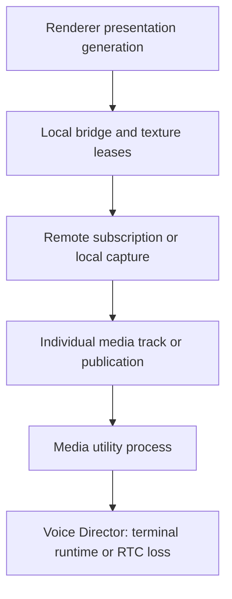

# Native v2 fault catalog

This catalog records the recovery boundaries for #131. Qualification is in progress;
no row is accepted until its deterministic and observer evidence exists.

The native fault runner reports owner assertions and process resource assertions
separately. A positive handle or thread delta fails the process even when all
100 owner assertions passed. Warmup count is explicit; it does not count toward
the required 100 measured iterations. Optional
`WINDOWS_MEDIA_CAPTURE_THREAD_DIAGNOSTIC=1` identifies thread modules at both
resource snapshots without recording process addresses or machine paths.

## Ownership and escalation

The arrows are escalation possibilities, not a command sequence. The immediate
owner handles the fault. A healthy Room is preserved for local media failures.
Only Voice Director may create a recovery Voice Operation. Main sends one latest
desired snapshot after host replacement; it does not replay command history.

Microphone, output endpoint, camera, screen video, screen audio and remote tracks
have independent scopes. Renderer presentation failure does not prove capture or
encoder failure. Query timeout alone does not prove utility death.

## Global limits to verify in composition

| Boundary | Current configured limit | Evidence still needed |
| --- | --- | --- |
| Native control start / ping / shutdown | 2,000 / 1,000 / 1,000 ms | Repeat fault while unrelated control is active |
| Room connect / disconnect / cancellation | 12,000 / 2,000 / 2,000 ms | Existing injected 10 ms tests run 100 times; retain operation IDs and resource deltas |
| Utility handshake | 5,000 ms | Late-ready and wrong-epoch suppression under restart |
| Utility restart backoff | 250 ms, 1,000 ms; two restarts | Ordinary start/control calls cannot bypass backoff or exhaustion. Only explicit runtime Retry replenishes the budget; it cannot bypass unconfirmed termination. |
| Retired SFU transport before fresh credentials | 6,000 ms total, including existing cleanup lookup; each SFU list/remove request is limited to 2,000 ms | Match all old authority claims, confirm absence before issuing credentials, preserve cleanup on failure. Unavailable SFU is not evidence of absence. |
| Graceful utility shutdown wrapper | 1,500 ms | This excludes the termination finalizer |
| Kernel-confirmed utility termination | 2,000 ms after kill | No replacement until the old process exits |
| Conservative supervisor shutdown composition | 3,500 ms | Actual finalizer composition and hung native proof |
| Desktop Voice grace / app process deadline | 2,500 / 4,900 ms | Independent process timer survives hung Effect finalizers; real active-product fault coverage remains required |
| Utility owner disappearance | Unnamed, non-inherited kill-on-close Windows Job Object | Closing the last main-owned job handle terminates the utility even when main exits without finalizers |
| Capture candidate | 3,000 ms | One candidate, no overlap with unresolved retirement |
| Capture attempt budget | One-second spacing, six/minute, three consecutive failures | Verify latest intent, exhaustion semantics and repeated partial recovery |
| Screen publication publish / submit / unpublish | 10,000 / 2,000 / 10,000 ms | Existing injectable deadlines can accelerate repeated SDK completion tests |
| Camera startup / no-frame / reader close | 4,000 / 2,000 / 2,000 ms | Separate error callback, missing callback and late callback evidence |
| Microphone no-progress | 1,000 ms | Real worker detects stopped progress without forged error state |
| Output no-progress / retry | 500 ms; three attempts, one-second spacing | Successful candidates retain the attempt count; explicit selection or a new device-registry revision resets it. Active/candidate isolation, latest intent and full-product proof remain required. |
| Output candidate cancellation | Event-driven cancellation of the five-second readiness wait; five-second native teardown fallback | New selection/retry/device revision or shutdown signals the pending worker immediately. The 500 ms cancellable-fixture assertion does not establish cancellation of a hung Windows API; that remains contained by the utility deadline. |
| Microphone candidate cancellation | Event-driven cancellation of the five-second readiness wait; five-second native teardown fallback | Selection, processing bypass, explicit retry, device revision and shutdown signal pending preparation. A healthy active capture remains attached to DSP until a new candidate is admitted. Non-cancellable platform calls still require utility containment. |
| Camera candidate cancellation | Event-driven cancellation of the four-second readiness wait; existing reader close and utility deadlines | Device/profile/retry or loss of all capture demand signals pending preparation. Forwarding commits only a ready, non-cancelled candidate; latest intent is reconciled again after supersession. |
| Native frame export age / queue | 150 ms; total 68, batch 16, remote 4/stream, preview 2/stream | Renderer never releasing must remain bounded without unsafe reuse |
| Electron transfer import acknowledgement / capacity | 1,000 ms / 68 process-wide | Timeout never frees an uncertain lease |
| Electron receiver release / final GPU release | 2,000 ms from send / 2,000 ms from main release; 250 ms sweep | One failure per retained lease; no retry or unsafe reuse; exact-frame release/destruction plus final GPU completion returns ownership |
| Incident pending / fingerprints / lease | 100 / 1,000 / two minutes | One causal episode across layers; account-isolated, redacted, bounded evidence |

Lower-level destructor fallbacks of 5, 6 or 25 seconds are not the app shutdown
budget. A non-cancellable call is contained by the utility process. No detached
cleanup worker may outlive an unbounded sequence of attempts.

## Required fault rows

Every row must record injection point, signal, detecting owner, local action,
deadline, retry limit, escalation, unaffected paths, public terminal state and
diagnostic evidence. The following is an implementation checklist, not a PASS
matrix.

| ID | Injection and observable signal | Immediate owner / expected action | Unaffected paths and terminal evidence |
| --- | --- | --- | --- |
| wgc-source-closed | Close an existing source; duplicate terminal callback | Window capture validates the opaque source identity and emits closed once | Room, microphone, camera and screen audio remain independent; screen source failure is typed |
| wgc-late-frame | Deliver a frame after stop or resize retirement | Capture generation fence rejects it and releases its lease | No new frame in the current generation; resources return after bounded retirement |
| dxgi-access-lost | Return ACCESS_LOST / DEVICE_REMOVED at duplication boundary | Selecting capture owner performs bounded local candidate recovery | Healthy Room and unrelated tracks retain their identities and observable media |
| encoder-no-output | Accept input while withholding encoder output, without returning error | Encoder liveness detector fails this screen publication | Distinct from bitrate setter rejection; no silent adaptation of resolution or FPS |
| publication-never-completes | Hold publish / submit / unpublish completion; later deliver it twice | ProductionScreenSender emits one terminal result; retained borrowed slots cannot be reused early | Unrelated control and audio continue until a non-cancellable SDK call requires utility retirement |
| remote-video-late-decoded | Inject decoded frame from removed/replaced track revision | RemoteVideoTrack rejects stale generation and releases frame | Other remote tracks, local publications and Room remain unchanged |
| renderer-never-releases | Withhold renderer GPU release acknowledgement | Presentation/bridge retains uncertain leases within fixed bounds | No unsafe reuse or unbounded retired generations; capture/publication continue where safe |
| screen-audio-process-exit | Exit the selected process or invalidate its loopback endpoint | ScreenAudioOwner ends that audio scope with typed failure | Screen video, microphone, camera, output and Room continue |
| microphone-active-loss | Device-lost error after healthy active capture | Microphone owner projects local failure/reselects according to latest device intent | Camera, screen/video/audio and Room remain; no new Voice Operation |
| microphone-candidate-failure | Fail activation on selected candidate call; old capture remains healthy | Candidate transaction discards failed candidate and preserves active input | DSP mute/PTT updates still apply to active capture; no publication churn |
| output-invalid-or-stalled | Explicit endpoint invalidation; separately stop render progress without error | Output owner uses finite local retry and candidate transaction | Microphone and Room persist; failed candidate does not silence a healthy active output |
| output-default-session-muted | Disable only the fixture process's default Windows audio session, as the SDK does for built-in playback | WASAPI output uses its own stable session across replacement workers | Actual process-loopback PCM remains audible, default-session mute remains intact, and worker resources retire |
| camera-removed-or-no-callback | Device removal; separately never signal pending source-reader sample | CameraCapture detects error or its two-second no-frame deadline; owner handles scope | Existing audio and screen remain; source-reader resources and late samples retire safely |
| room-connect-cancel-late | Hold connect, cancel it, then return old success and duplicate callback | RoomOwner uses unique attempts and exactly-one terminal result | New desired Room cannot be mutated by the old attempt |
| utility-crash | Kill the actual utility process during media | Main supervisor reports one host-epoch loss, verifies exit and handshakes replacement | Latest desired state only; no old replies, ghost participants or duplicate publications |
| renderer-reload-or-crash | Replace renderer while Room/media are active | Presentation generation retires; listeners precede atomic inventory replay | Same Room, Voice Operation and publication identities; new renderer demand is fenced |
| latest-intent-during-retry | Apply a newer intent during each owner's pending/backoff state | Immediate owner cancels/supersedes the old attempt | Old completion cannot restore old source/device/preset/publication |
| shutdown-during-fault | Shutdown during every pending/held SDK/platform operation | Stop outranks retry; utility is the outer non-cancellable boundary | Actual parent/utility exit and resource retirement within composed app budget |
| combined-contention | GPU pressure, audio gap and withheld renderer release together | Each failing scope has one owner; escalate only from lost liveness | Neutral observers prove which paths continued; bounded queue/VRAM/thread/handle evidence |
| bitrate-setter-rejected | Return unsupported/rejected setter while encoded output continues | Keep same encoder, selected preset, publication and Room; deduplicate warning | Last confirmed bitrate preserved; continuing output proves that restart is forbidden |

## Evidence contract

`pnpm --filter @syrnike13/windows-media-engine test:fault-matrix --config Release`
runs the complete local CTest suite and writes a redacted native-owner artifact
under `.codex-tmp/native-faults/`. `--config Debug`, `--asan` and `--output <file>`
select the configuration and destination. `WINDOWS_MEDIA_BUILD_ROOT` selects the
same build directory used by `scripts/build.mjs`. First commit the source and
build that commit with `--lab` and the matching configuration/sanitizer options.
The reporter refuses a stale cache or dirty tracked source; every fault result
must also carry matching commit, configuration, ASan and MSVC identity compiled
into the test binary. It hashes executables/modules before and after the run and
rejects source changes, binary changes, skipped tests, missing/duplicate rows,
fewer than 100 repetitions and positive or inconsistent resource deltas.

The required native list currently has 42 rows. Unsupported and rejected live
bitrate updates each have a separate 100-lifecycle CTest entry, preserving the
existing media-identity and warning assertions. They require GPU video hardware;
the unresolved MFT activation resource issue applies to these runs as well.
The reporter records owner evidence only. Its successful exit does not replace
neutral observers, full-product replay/shutdown, correlated incidents, other
build configurations or #132 hardware/soak evidence.

The machine-readable result must distinguish:

1. deterministic owner/adapter execution (at least 100/100 per fault);
2. real platform or SDK execution;
3. neutral receiver continuity and track identity;
4. real product host/renderer replay and composed shutdown;
5. Release, Debug and ASan configurations.

Record exact source/build commit, scenario, injected attempt/call, repetitions,
terminal outcome, maximum observed duration, retry counts, queue/resource peaks,
baseline/deltas, stale/duplicate callback outcomes and observer evidence paths.
Missing or skipped rows fail qualification; a successful test process does not
imply 100 executions. Synthetic decoded frames do not prove physical camera or
acoustic quality. Hardware qualification belongs to #132 and remains separate.

One causal episode has an explicit owner-supplied identity. A fatal native event
and the supervisor's resulting retirement share that identity. An unexpected
utility exit records its cause before restart state is projected. A replacement
host's successful handshake ends that host-failure episode, without resetting
the finite restart budget or claiming media-path stability. Presentation has its
own episode per failed stream; full release/recovery or owner replacement permits
a new episode. Unrelated faults are never grouped merely by time proximity.

Incident reports alias the owner identity and retain the original root fields and
highest observed severity. Up to eight redacted related events enrich the root;
100 pending incidents and 1,000 episode roots/correlation aliases bound memory.
An active upload lease is immutable. Later evidence becomes a follow-up under
the same correlation; release or expiry merges that follow-up into the retried
root instead of queuing duplicate roots. Account changes discard all episode
state. Tests cover 100 distinct cross-layer episodes, 100 fatal host replacements,
lease release/expiry, root eviction, account isolation and the product wiring.

## Qualification constraints

- #130 merged through PR #144 (`fb3b8182`).
- The only available physical machine is NVIDIA RTX 5070 Ti / Windows 11.
- Hosted Windows CI lacks D3D11 Video interfaces; excluded GPU labels remain
  required in the default local suite.
- Hosted CPU Media Lab had one 2,692 ms stale frame during 95–96% CPU saturation;
  its 1,500 ms limit was preserved. Local repeat passed at 304 ms maximum age.
- Earlier hosted WGC resource probes intermittently reported one extra process
  thread. Optional thread/module diagnostics now exist; no root cause is claimed.

## Presentation release ownership

The main transfer owner detects missing receiver release independently of import
acknowledgement. Once Electron begins releasing its last local reference, a
separate deadline detects a missing GPU completion callback. Both deadlines use
a monotonic clock, with at most 250 ms sweep latency while main is scheduled.
A timeout retains the texture and its native lease; it is never release proof.
A destroyed renderer ends its receiver reference, but final GPU completion is
still required. Capacity remains 68 across accounts, renderers and utility epochs.

A crashed renderer can leave its `WebFrameMain` wrapper alive. Each admitted
transfer therefore retains a read-only Windows process reference and immutable
acknowledgement target IDs. Only a signaled kernel process object or exact frame
destruction proves that receiver reference is gone; a changed PID alone does not.
The process reference closes after the final GPU callback. A 100-cycle unit
regression covers reused wrappers, stale acknowledgements and duplicate GPU
callbacks. The real isolated Windows guard fixture also retained receiver
references through 100 termination and 100 job-close cycles, following 100 warmup
cycles of each: measured handle/thread deltas were 0/0 at `56e47f0b`.

The Release product-adapter run at `073d6ae7` passed 100 real reloads and 100 real
renderer crashes, followed by successful media cleanup and normal process exit.
The independent receiver retained all four publication identities and observed
frame progress on every iteration. Maximum receiver gaps were 158 ms for reload
and 156 ms for crash, against the unchanged 1,500 ms limit. Maximum complete
iteration times were 929 and 872 ms respectively. The unchanged redacted report
is `renderer-faults-release-073d6ae7.json.gz`.

The preceding `56e47f0b` run also completed both media series, but failed overall:
the window-destruction handler accessed an already-destroyed `BrowserWindow`,
opening Electron's uncaught-exception dialog during exit. The owned test process
was terminated after diagnosis; its original FAIL report is preserved as
`renderer-faults-release-56e47f0b.json.gz`. The handler now compares the retained
window owner without accessing the destroyed native wrapper.

These runs exercise the production adapter, utility, preload and isolated SFU.
They do not yet qualify incoming remote presentation, held renderer releases,
full-product Voice Director/backend replay, combined faults, resource retirement
for every media owner, or Debug/ASan.

A presentation failure is scoped to the stream and current renderer/revision/host
epoch. Other streams cannot clear it. Every stalled lease in that stream must
drain before the public path recovers. Import acknowledgement alone does not
prove recovery. Repeated sweeps and duplicate callbacks have no additional
terminal effect. Capture, publication and Room are not restarted by this owner.

The existing frame-controller test runs 100 receiver-release stalls and 100
GPU-release stalls with fake time. Each iteration retains the failed texture,
completes a second consumer, rejects a wrong-frame acknowledgement, delivers
late/duplicate completion and returns to zero retained entries. This is owner
contract evidence; neutral receiver and real Electron fault evidence are still
required for the matrix.

## Shutdown and process containment

The 4,900 ms process timer is scheduled before scoped disposal starts. It calls
Electron `app.exit(0)` if disposal cannot settle, including an uninterruptible
finalizer. Successful disposal clears the timer. The existing 2,500 ms Voice grace
and graceful utility shutdown/termination deadlines are unchanged.

Main retains both a kernel process handle and an unnamed Job Object for each
utility. The job is non-inherited and has `JOB_OBJECT_LIMIT_KILL_ON_JOB_CLOSE`;
process disappearance therefore closes it without needing JavaScript cleanup.
Assignment failure rejects host bootstrap. Normal retirement still waits for the
retained process object to become signaled before replacement. This follows the
[Windows job lifetime contract](https://learn.microsoft.com/en-us/windows/win32/procthread/job-objects).

The shutdown test injects hung Voice and remaining-resource finalizers 100 times
each and verifies exactly one process-exit callback at 4,900 ms. The lifecycle
smoke uses the real native broker for 100 explicit terminations, 100 guard closes
and 100 abrupt parent deaths, then checks descendant exit through retained
kernel handles. It runs in an isolated Node host and Electron integration.
Each measured batch follows 100 identical warmup cycles; logging is initialized
before sampling to avoid counting its lazy stdout handle as a guard leak.
The isolated host must return handles/threads to baseline. Chromium integration
records its complete process delta separately because Chromium background
services are outside the guard's ownership. Neither test proves active-product
media continuity or replaces the pending combined shutdown matrix.

## Native platform fault execution

The following probes exercise native ownership; they are not neutral receiver
or complete product qualification. Final configuration/commit evidence is still
required. Configure with `--lab` for the platform audio probes. They are registered
in the full local CTest suite with label `requires-audio-device`; hosted CI
explicitly excludes this label because it has no qualified audio endpoints.
Missing lab/audio execution is missing evidence, never a pass.

| Probe | Measured repetitions and assertions |
| --- | --- |
| `production_screen_sender_tests` | 100 each: duplicate submit; held publish, submit and unpublish. Late callbacks cannot resurrect a failed generation or release the next borrowed frame. Shipping deadlines remain unchanged; these adapter tests use injectable 20 ms deadlines. |
| `camera_tests` | 100 device errors and 100 withheld real reader callbacks. The latter uses the shipping two-second no-frame detector and verifies reader/sample retirement. |
| `camera_tests --cancellation` | 100 withheld candidate callbacks using the existing synthetic reader and real capture/forwarding workers. Cancellation retains the healthy generation and forwarding progress, rejects obsolete retries, and releases the candidate plus its late callback sample. |
| `dxgi_capture_tests` | 100 each ACCESS_LOST and DEVICE_REMOVED, injected at AcquireNextFrame after a real first frame. One typed terminal callback, balanced acquire/release, zero remaining textures and leases. |
| `shared_texture_pool_tests` | 100 late decoded frames across demand replacement and stop; a second owner keeps its generation and continues uploading. All retained GPU resources drain. |
| `microphone_capture_allocation --fault-matrix` | 100 active device-loss HRESULTs and 100 actual client stops without an error. Faults are armed only after start has returned healthy; the no-progress detector remains one second. |
| `media_lab microphone-candidate-fault` | 100 failed WASAPI candidate opens. The retained capture generation continues producing frames, mute still produces digital silence, and returning to the healthy selection does not reopen capture. |
| `media_lab microphone-cancellation` | 100 latest selections and 100 shutdowns during blocked candidate preparation through the shipping MicrophoneOwner. Latest selection retains healthy PCM progress and generation with no stale failure or publication; shutdown joins the pending capture and DSP workers within the 500 ms fixture assertion. |
| `remote_audio_lab fault-matrix` | 100 invalidations, 100 actual output client stops with the shipping 500 ms no-progress detector, 100 failed candidate transactions, and 100 finite retry sequences. A healthy second worker continues consuming; a failed candidate preserves the active output epoch and live deafen controls. Only the retry schedule uses a test clock; all WASAPI health and shutdown clocks remain real. |
| `remote_audio_lab cancellation` | 100 each: cancelled preparation retaining the active output; newer desired selection through the shipping OutputOwner; shutdown through that owner during pending preparation. Preparation blocks on the worker's cancellation event. Old terminal errors cannot appear on the new desired revision, the healthy epoch keeps consuming, cancelled retries allocate no candidate, and shutdown joins all workers. |

DXGI stress initially added five handles and one thread. Module diagnostics
identified the additional thread as `nvwgf2umx.dll`; a subsequent identical batch
had no growth. DXGI now warms the complete 100-cycle workload before each measured
100-cycle batch, recording that warmup explicitly. The resource assertion remains
zero positive growth. This is separate from the unresolved encoder activation
resource growth on the same machine.

The first microphone no-progress batch initially left one extra process handle.
An instrumented run identified a Windows thread-pool thread handle while every
capture worker, client and MMCSS registration retired. The microphone no-progress
probe therefore also warms its full 100-cycle workload before measuring 100
cycles. The following measured batch returned 190 handles and six threads to
the same baseline, with a maximum iteration of 1,101 ms. Diagnostic pauses were
removed before that run and are not part of the test.

The output retry regression initially failed because each successful candidate
reset the automatic attempt count. Success now preserves that count. The probe
performs four active endpoint failures, checks the one-second gate, permits only
three automatic replacements, then verifies that an explicit retry starts a new
budget. Its injected clock applies only to the retry schedule, not to WASAPI
progress or cleanup. All 100 measured sequences returned 205 handles and six
threads to baseline.

Output cancellation uses a per-selection stop source, independent of mute/volume
and unrelated media revisions. After readiness, a cancellation check admits the
healthy candidate to the serialized mixer commit; subsequent desired state is the
next transaction. Cancellation never waits for a platform call on the submitting
lane. The owner suppresses the cancelled transaction's terminal projection and
retains the previous problem state until it processes the latest intent.
The three cancellation rows passed 100 measured repetitions each with 212 handles
and six threads unchanged. Maximum complete iterations were 62, 79 and 53 ms.

The separate output platform matrix is not yet resource-qualified: a later CTest
run left one additional process thread after 100 invalidations; the diagnostic
rerun returned that row to baseline but left one extra handle after 100
no-progress faults. That run showed only Windows thread-pool entries in the
final thread inventory. Their involvement does not establish the handle's cause.
Both failed resource results remain failures despite successful owner assertions.

Microphone cancellation passed both 100-cycle owner rows with 230 handles and 20
threads unchanged; each complete iteration was below 119 ms. The existing failed
candidate regression also passed 100 cycles after the signature changes. Both
audio owners force reconciliation of the latest selection after a cancelled
transaction, including a change arriving just after commit admission: equality
with an older applied intent must not leave an intermediate selection active.
Output cancellation's subsequent CTest run also observed a positive thread delta;
a diagnostic rerun passed all three owner rows, which does not resolve that
intermittent resource result. Thread diagnostics now record kernel termination
state without changing resource counts or budgets.

Camera's complete suite passed after cancellation support, including 100 candidate
cancellations, 100 device removals and 100 missing callbacks. All three rows had
zero positive handle/thread deltas. These use the existing reader adapter and
real capture/forwarding workers; product-owner and physical camera proof remain
separate requirements.

## Active renderer fault runner

`MEDIA_PRODUCT_RENDERER_FAULTS=1` enables 100 real renderer reloads, 100 real
renderer crashes and 100 withheld texture-release cycles in the existing
`@syrnike13/native-media-lab product` runner.
The publisher uses the shipping Electron adapter, utility and preload with the
isolated project SFU. Each replacement must replay inventory and show ten camera
and screen frames plus ten incoming companion frames, retaining the native epoch,
Room credential lease and running media paths. The existing 15-second readiness
deadline bounds each wait; the
complete fault batch has a 900-second test-process deadline.

An independent LiveKit receiver verifies all four unchanged publication aliases
and new decoded frames during every measured iteration. It rejects missing or
duplicate publications and any observed media gap above 1,500 ms. Evidence keeps
three aggregate rows, minimum per-iteration frame progress and maximum gaps/durations;
it does not retain per-frame logs. The evidence parser rejects missing, duplicate,
out-of-order and partial results. A physical camera is required in this mode.

The release-stall row holds two renderer-owned screen frames until the production
bridge reports its release deadline. Camera, incoming video and outgoing media
must continue. Closing those frames must restore screen preview within three
seconds; detection has its own three-second test deadline. The runner records
maximum retained textures without treating uncertain GPU leases as released.

The [original Release report at `a1e70c1e`](renderer-faults-release-a1e70c1e.json.gz)
passed all three rows on 2026-09-09. Reload and crash maxima were 1,554 and 1,936 ms;
each recovered at least ten incoming frames. The independent outgoing receiver's
maximum gaps were 469 and 251 ms. Withheld releases were detected within 2,288 ms,
retained at most four textures, and completed recovery within 2,581 ms. That row's
maximum outgoing gap was 246 ms and minimum incoming progress was 33 frames.
All four outgoing publication aliases remained unchanged, with zero observer
reconnects or reader failures. The publisher completed cleanup and exited with
code zero, without reaching its process deadline.

The [preceding failed report at `3cd9a0b0`](renderer-faults-release-3cd9a0b0.json.gz)
is preserved too: incoming video remained in `Starting` after 13 completed reloads,
while local media continued and no presentation leases remained outstanding.
`a1e70c1e` adds diagnostic counters, not a recovery fix. Its successful repeat
does not resolve that intermittent failure. The pinned SDK's subscription event
handling is under investigation; no causal conclusion follows from this pass.

Resource retirement, combined faults, utility replacement, Voice Director/backend
authority, remote audio output measurement and other build configurations remain
separate qualification requirements.

The [original SDK integration repeat](renderer-faults-release-b3fa3ecf-sdk-d966cee.json.gz)
used app `b3fa3ecf` and SDK `d966cee`; its
[source and binary identities](renderer-faults-release-b3fa3ecf-sdk-d966cee-identity.json)
were unchanged before and after execution. All three 100-cycle rows passed.
Maximum reload/crash/release-stall durations were 1,539/1,587/2,564 ms;
the independent receiver gaps were 122/114/114 ms. Every replacement recovered
at least ten incoming frames. Release stalls retained at most four textures.
The SDK fixes subscription event state updates that previously sent a redundant
subscription request. This repeat does not establish that defect as the cause
of the earlier intermittent incoming-video stall.

## Full-product utility recovery investigation

The [single successful pilot](full-product-utility-7a3b87ab.json) uses the actual
desktop UI, Voice Director, local backend and SFU with an independent browser
participant; [artifact identities](full-product-7a3b87ab-identity.json) record
app `7a3b87ab` and SDK `d966cee`. A utility kill followed by pending mute changes
settled within 5,210 ms. The replacement retained the latest mute intent, its
SFU participant matched the new Voice Operation/connection epoch, and incoming
and outgoing camera frames resumed. The browser's publications were unchanged.
Old host media paths were invalidated before replacement availability; no old
`running` microphone projection appeared. This checks state projection, not PCM
privacy. Screen replay reported an expired source handle and required reselection.

The [subsequent third-crash report](full-product-exhaustion-7a3b87ab.json) failed:
after two automatic recoveries, ordinary product control started another host
from `failed`, bypassing the supervisor budget. Regression tests also reproduced
ordinary start bypassing the scheduled backoff. The supervisor now separates
ordinary start from explicit runtime Retry, and terminal Room cleanup no longer
waits for a snapshot from the exited host. Unit and IPC tests cover exhaustion,
backoff, manual budget renewal and refusal to replace an unterminated host.
The corrected full-product exhaustion/manual-Retry run and the 100-cycle utility
qualification remain required; the successful single pilot is not that gate.

The next local run at `f4096cdd` reached stable exhaustion and explicit Retry,
but its first injected utility crash caused an additional, spontaneous host exit.
Its original pilot report's success flag is rejected: the observer did not yet
require exactly one host replacement per injection. That assertion is now
mandatory. A diagnostic repeat captured `0xC0000409` in microphone-owner shutdown
while an SDK thread remained in `LocalParticipant::publishTrack`; this is not a
successful recovery qualification.

The [original pilot](full-product-utility-f4096cdd-1.json) and its explicit
[rejected qualification assessment](full-product-f4096cdd-assessment.json) are
both retained, alongside [exhaustion](full-product-exhaustion-f4096cdd.json),
[manual Retry](full-product-manual-retry-f4096cdd.json) and
[binary identities](full-product-f4096cdd-identity.json).

The adapter had replayed the lost Room's credential into the replacement host
before Voice Director retired its backend authority. It now reports terminal
Room loss as soon as utility recovery begins and holds publication until Voice
Director provides a fresh lease. A late rejected request from a retired host or
lease also cannot reject a new Room waiter. Regression tests reproduce both
ordering defects; the native crash's causal resolution still requires the
full-product rerun.

At `258d7838`, two successive real utility kills each created exactly one
replacement without the previous native crash, but failed because the old and
new SFU participants overlapped. The [second failure report](full-product-utility-258d7838-2.json)
preserves both participants and their publication identities. Backend cancellation
retired authority immediately while leaving transport deletion to background
cleanup. Fresh credential creation now drains that user's existing retired
transport records within the budget above, using the same exact-claim retirement
logic as the background reconciler. A failed removal or confirming query cannot
allow another credential. Full-product verification of this change remains due.

[Exhaustion](full-product-exhaustion-258d7838.json) and explicit
[manual Retry](full-product-manual-retry-258d7838.json) passed again on
the [same app build](full-product-258d7838-identity.json); explicit recovery took
2,679 ms. These are individual checks, not the required 100-cycle utility gate.

The first [full-product run at `224d94fe`](full-product-utility-224d94fe-1.json)
prevented the duplicate but failed recovery: backend returned `LiveKitUnavailable`
while retirement was still pending, and the gateway adapter classified that
temporary error as non-retryable. The [artifact identity](full-product-224d94fe-identity.json)
also records the local backend binaries and their dev profile. The adapter now
preserves retryability for this specific backend error; permission and unknown
rejections remain terminal. Voice Director also clears the lost Room's observed
media states immediately, instead of retaining stale Running states during a
failed recovery. Its desired media intent remains available for the new lease.
All 36 gateway/Director tests pass, including both reproduced regressions.

A diagnostic build with the retry classification passed a single utility cycle
in 5,600 ms with exactly one host replacement, no overlapping SFU participants
and bidirectional camera progress. This was an uncommitted diagnostic build,
not exact-commit qualification. An earlier diagnostic repeat lacked its browser
observer after a Vite dependency reload and is invalid evidence. The harness now
requires both participants and recent incoming frames before injecting any fault;
it also samples main/utility handles, threads and memory. The 100-cycle gate
remains outstanding.

## Full-product development series at `48da394c`

The [redacted development series](full-product-utility-dev-48da394c.json.gz)
contains the exact app/backend/SDK identities, all 114 JSON reports and their
source hashes. It completed 56 utility injections and 28 exhaustion/explicit
Retry checks. The slowest successful primary cycle took 7,981 ms. Before the
57th injection, its baseline rejected incoming frames older than 2.7 seconds;
the voice connection and both SFU participants remained present. No 57th fault
was injected and this is not the required 100-cycle PASS. The frames subsequently
resumed without another utility replacement. Application and harness hashes were
verified unchanged after the series.

Renderer private memory grew from 347 MiB to about 2.5 GiB. The separate
[post-run memory diagnosis](full-product-dev-memory-48da394c.json) found roughly
2.5 million React development `PerformanceMeasure` entries. After clearing the
performance timeline and collecting garbage, private memory fell to 692 MiB and
embedder heap usage fell from 315 MiB to 6 MiB. These diagnostic actions occurred
after the series stopped. They do not make the run a resource PASS or establish
that the rendering gap had only one cause. The next run must use the production
frontend; the development instrumentation constraint is recorded in `know-bugs.md`.

The [product harness](../../apps/desktop/scripts/product-faults/README.md) is now
in the repository. Its production-compatible draw probe observes successful
canvas draws without importing a Vite module or retaining VideoFrames. Its
real production-frontend run remains required.

SDK [v1.10.0-syrnike.15](https://github.com/syrnike13/client-sdk-cpp/releases/tag/v1.10.0-syrnike.15)
is published from merge commit `0906793` and is now hash-pinned by the app. All
seven platform builds and release documentation validation passed. The downloaded
Windows archive matches SHA-256 `0591cb265e0eea037c05614f7c972c832a64194059e006b437660605d3646cf3`;
its embedded identity matches the release. Separate post-release documentation
upload failed because the fork lacks upstream AWS credentials. The archive is
available; application qualification on this published binary remains due.

The [published-SDK production-frontend pilot and incomplete series](full-product-utility-production-aeba53f9.json.gz)
record app `aeba53f9` with DLLs matching the `.15` archive. The pilot recovered in
8,743 ms with no UI errors; the production renderer had zero performance measures
and 170 MiB private memory. The next fresh run completed two utility cycles and
one exhaustion/manual Retry check, then rejected stale frames before injecting
its third fault. Renderer memory was 201 MiB. This shows that the prior development
memory growth does not by itself explain every preparation-time rendering gap.

The harness had waited for media `Running` states, then immediately required fresh
incoming video. It now waits for the complete fixture, including recent incoming
draws, within the existing 15-second preparation budget. The injected-fault clock
starts afterward and its limits are unchanged. The draw observer also counts a
frame only once when multiple canvases draw it. The previous reports remain
incomplete evidence; the corrected 100-cycle run is still required.

The corrected [production-frontend series at `e3306bce`](full-product-utility-production-e3306bce.json.gz)
passed 100/100 primary utility crashes and 49/49 exhaustion/explicit Retry checks.
Maximum primary recovery time was 7,072 ms. Each primary fault created exactly
one replacement, applied the latest mute intent, obtained fresh Voice Authority
matching the SFU participant, and resumed incoming/outgoing camera presentation.
The observer retained its publications. There were no desktop or observer UI
errors. The final runtime was Ready at host epoch 150, lifetime restart count 149.

All 142 recorded application/frontend/harness hashes matched after the run, and
the three running backend binaries retained their recorded hashes. The archive
contains 199 reports with source hashes, build identities and the post-run check.
Frontend source was unchanged from its production build at `aeba53f9`.

Across post-recovery samples, main handles ranged 1,042–1,053; renderer handles
356–374; GPU handles 808–826. Renderer private memory peaked at 226 MiB and later
settled to 160 MiB without clearing performance measures or forcing GC. There
were zero performance measures. Resource samples are retained rather than
treated as proof for the complete matrix: this run qualifies the declared
utility replay/authority/camera scope, not incoming PCM privacy/output,
combined faults, every pending-operation shutdown or Debug/ASan coverage.

Windows CI separately exposed package-script shell interpretation of the `|` in
the hardware-label exclusion regex. Its Debug/ASan builds had succeeded, but
media tests did not start. The workflow now invokes CTest directly and stops
when an earlier build/test/probe command fails. Hardware exclusions are unchanged;
a read-only selection check found 30 tests and no excluded hardware labels.

## Recorded Release matrix at `84a050dc`

The [unchanged redacted artifact](native-faults-release-84a050dc.json) records all
41 native fault rows from the complete 47-test Release suite on 2026-09-09.
CTest completed in 1,636 seconds: 44 tests passed and the three encoder tests
failed. All three completed 100 behavioral iterations but retained 201 additional
process handles each. Their thread deltas were -3. Maximum complete iterations
were 2,197 ms for withheld output, 1,462 ms for unsupported bitrate and 5,919 ms
for rejected bitrate. None of these rows qualifies as a PASS.

All output and microphone rows returned to their sampled baselines in this run.
This does not resolve the previously recorded intermittent output resource growth.
The failed encoder rows remain consistent with the isolated activation problem
documented in `know-bugs.md`; the overlay hypothesis is still unconfirmed.

The original report also preserves two reporter defects: padded CTest test
numbers were missed, and a 173,286-character source-enumeration line was treated
as oversized evidence. Both parsers are now corrected. Replaying the retained
log through the bounded line reader recovered the same 41 fault records and the
same three resource failures without parsing errors. The original artifact was
not rewritten, and this replay is not another native test execution.

## Output session isolation regression

After the production utility series, an independent browser source sent a
997 Hz tone with nonzero WebRTC audio energy. Product output reported Running,
but process-loopback captures of both main's tree and the utility measured only
dither (peak RMS 0.51). A read-only Windows session probe found nonzero signal
in the utility's muted default session, at volume zero. Rejoining the Room and
toggling deafen did not restore audible output.

The [diagnostic before/after result](output-session-isolation-diagnostic.json)
records the regression and its exact reported scope. The output worker now uses
a stable dedicated session GUID, preserving that
session's mixer preferences through retries. It does not change the SDK session
or endpoint controls. The new regression failed with the previous default-session
initialization and passed all 100 worker lifecycles after the fix: ten actual
loopback packets per cycle, maximum cycle 230 ms, zero handle/thread deltas.
These were diagnostic builds with uncommitted source at base `baa0c9af`; exact
commit and full-product PCM/recovery qualification remain required.

The subsequent [full-product PCM series](full-product-utility-pcm-ac3ca0fa.json.gz)
passed 100/100 primary utility crashes, with actual incoming process-loopback PCM
before and after every crash. It also passed 49/49 exhaustion and explicit Retry
checks. Maximum primary recovery was 12,216 ms. There were no desktop or observer
UI errors. The final runtime was Ready at host epoch 150, restart count 149.

The application was built at `ac3ca0fa`, the reporting harness at `0ffec11a`, and
the unchanged production frontend at `aeba53f9`; the archive records these
identities separately. All 144 application/frontend/probe/harness hashes and
three backend binary hashes matched after the run. Its 199 original reports
retain their hashes. Renderer private memory settled to 205 MiB with zero
performance measures and no forced GC or timeline clearing. This result proves
sampled incoming PCM through utility recovery; microphone mute privacy,
continuous gaps, combined faults and the remaining #131 gates remain separate.

## Recorded Debug matrix at `baa0c9af`

The [unchanged Debug artifact](native-faults-debug-baa0c9af.json) contains all
41 then-required native fault rows and 44/47 passing CTest tests. Each of the
three encoder rows completed 100 owner assertions but retained 201 handles;
their thread deltas were -3. All other rows passed, including the output and
microphone rows. This remains a failed qualification and predates the additional
output-session-isolation regression.

The next hosted Debug run also failed the monitor-repeat resource check: all
100 requested frames arrived and final handles/threads were 249/8 against a
249/10 baseline, but one intermediate cycle exceeded the thread baseline by one.
ASan passed its hosted subset. Neither a final decrease nor a passing owner
assertion overrides the failed intermediate resource gate.

## Diagnostic archive fairness under media load

The main process originally spent 3,783 ms without yielding while building a
diagnostic archive. This delayed detection of withheld renderer releases beyond
the 3,000 ms deadline. Native journal normalization, budget calculation, tail
selection and final serialization now yield every 64 records; tail selection
also avoids repeated array prepends. Existing redaction and archive size limits
remain enforced. A regression test fails on the previous implementation and
passes with the fix; both diagnostic bundle suites and desktop typecheck pass.

The [diagnostic pilot artifact](bundle-yield-diagnostic.json) records the full
application at `6d518feb`. Replaying 18,710,176 bytes of saved main journals took
2,815 ms overall with a maximum main-loop delay of 25 ms. During a combined
renderer-release stall, incoming tone gap and GPU load, an explicit archive took
2,716 ms while detection completed in 2,125 ms and audio recovered in 392 ms.
Maximum main-loop delay was 24 ms. The independent receiver preserved all four
publications and media progress. Three subsequent receiver shutdown checks
completed in 85–92 ms without forced gateway closure.

These are diagnostic pilots with separately evolving fixture sources, not the
100-cycle qualification. The original and replayed journal sets differ, so
their total archive times are not a controlled throughput comparison. The
artifact explicitly retains that limitation and does not claim full #131 PASS.

## Combined full-product faults at `b007397a`

The [unchanged combined-series archive](full-product-combined-b007397a.json.gz)
records 100/100 passing cycles with two actual renderer frame clones withheld,
an incoming tone gap and bounded GPU load. Maximum stall detection was 2,302 ms,
audio recovery 407 ms and presentation recovery after release 32 ms. The
conservative maximum sampled incoming silence was 700 ms. The independent
native receiver retained all four publication identities, made progress in
every cycle and observed a maximum media gap of 308 ms. Backend authority,
utility identity and all three participants remained stable. Desktop and browser
error lists were empty; the receiver exited normally without forced gateway
closure. All 158 recorded files and three backend binaries matched after the run.

The [main-owner incident capture](presentation-incidents-b007397a.json) contains
100 incidents with distinct correlations and occurrence count one, plus the
200 journal projections for those episodes. It does not qualify a complete
cross-layer causal timeline or successful incident upload.

Process resources were sampled during this series, and texture retention stayed
within the existing bound. These samples are not zero-growth qualification.
Microphone mute privacy, pending-operation shutdowns, failed native resource
gates and final matrix coverage remain outstanding; this is not full #131 PASS.

## Microphone privacy through utility replacement

The [unchanged 199-report archive](full-product-microphone-c5becbc9.json.gz)
contains 100/100 passing primary crashes and 49/49 exhaustion/explicit Retry
checks. Every primary row includes actual incoming output PCM and an independent
receiver's microphone PCM before and after replacement. Each baseline was
nonzero; the minimum peak baseline window RMS was 129.99. Every replacement
microphone publication was distinct, and its maximum RMS across all received
frames stayed below the existing limit of 2 (overall maximum 0.756). Maximum
primary recovery was 8,862 ms. Desktop/browser error lists were empty; the
independent receiver reported no failures or reconnects and exited normally.
The isolated profile's original microphone settings were restored afterward.

The application remained at `b007397a`; microphone assertions and the fresh
receiver ran from `c5becbc9`. The Node process retained the older `b007397a`
series driver in its module cache. Its loaded function was compared directly
with that source and matched; the archive includes both hashes and that source.
Consequently the original summary lacks the newly added privacy counter. It was
not rewritten: the supplemental count of 100 is derived from the 100 original
passing microphone reports. All 158 recorded file hashes and three backend
binary hashes matched after execution. Node, Electron and Chrome executable
hashes also matched the preceding combined-run capture.

This qualifies the stated microphone/incoming-PCM utility scope. It does not
qualify zero resource growth, every pending-operation shutdown, complete
cross-layer incidents or the remaining native matrix failures.
