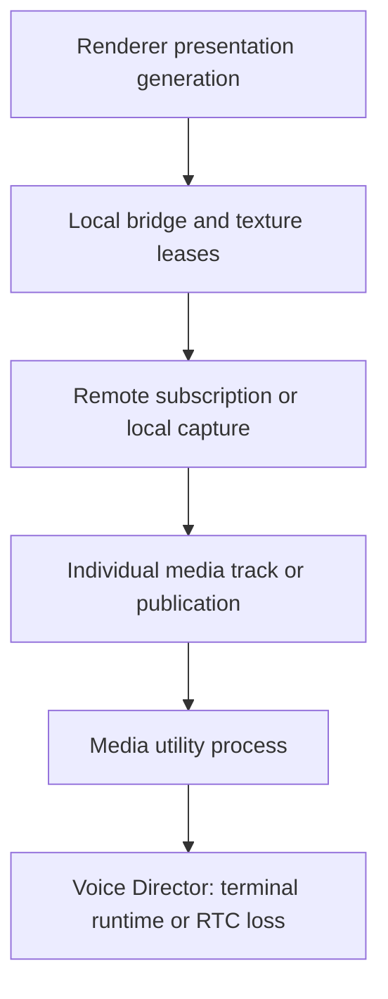

# Native v2 fault catalog

This catalog records the recovery boundaries for #131. Qualification is in progress;
no row is accepted until its deterministic and observer evidence exists.

## Ownership and escalation

The arrows are escalation possibilities, not a command sequence. The immediate
owner handles the fault. A healthy Room is preserved for local media failures.
Only Voice Director may create a recovery Voice Operation. Main sends one latest
desired snapshot after host replacement; it does not replay command history.

Microphone, output endpoint, camera, screen video, screen audio and remote tracks
have independent scopes. Renderer presentation failure does not prove capture or
encoder failure. Query timeout alone does not prove utility death.

## Global limits to verify in composition

| Boundary | Current configured limit | Evidence still needed |
| --- | --- | --- |
| Native control start / ping / shutdown | 2,000 / 1,000 / 1,000 ms | Repeat fault while unrelated control is active |
| Room connect / disconnect / cancellation | 12,000 / 2,000 / 2,000 ms | Existing injected 10 ms tests run 100 times; retain operation IDs and resource deltas |
| Utility handshake | 5,000 ms | Late-ready and wrong-epoch suppression under restart |
| Utility restart backoff | 250 ms, 1,000 ms; two restarts | No reset merely because a replacement handshakes; exhaustion is terminal |
| Graceful utility shutdown wrapper | 1,500 ms | This excludes the termination finalizer |
| Kernel-confirmed utility termination | 2,000 ms after kill | No replacement until the old process exits |
| Conservative supervisor shutdown composition | 3,500 ms | Actual finalizer composition and hung native proof |
| Desktop Voice grace / app process deadline | 2,500 / 4,900 ms | Independent process timer survives hung Effect finalizers; real active-product fault coverage remains required |
| Utility owner disappearance | Unnamed, non-inherited kill-on-close Windows Job Object | Closing the last main-owned job handle terminates the utility even when main exits without finalizers |
| Capture candidate | 3,000 ms | One candidate, no overlap with unresolved retirement |
| Capture attempt budget | One-second spacing, six/minute, three consecutive failures | Verify latest intent, exhaustion semantics and repeated partial recovery |
| Screen publication publish / submit / unpublish | 10,000 / 2,000 / 10,000 ms | Existing injectable deadlines can accelerate repeated SDK completion tests |
| Camera startup / no-frame / reader close | 4,000 / 2,000 / 2,000 ms | Separate error callback, missing callback and late callback evidence |
| Microphone no-progress | 1,000 ms | Real worker detects stopped progress without forged error state |
| Output no-progress / retry | 500 ms; three attempts, one-second spacing | Active/candidate isolation, latest revision and budget reset semantics |
| Native frame export age / queue | 150 ms; total 68, batch 16, remote 4/stream, preview 2/stream | Renderer never releasing must remain bounded without unsafe reuse |
| Electron transfer import acknowledgement / capacity | 1,000 ms / 68 process-wide | Timeout never frees an uncertain lease |
| Electron receiver release / final GPU release | 2,000 ms from send / 2,000 ms from main release; 250 ms sweep | One failure per retained lease; no retry or unsafe reuse; exact-frame release/destruction plus final GPU completion returns ownership |
| Incident pending / fingerprints / lease | 100 / 1,000 / two minutes | One causal episode across layers; account-isolated, redacted, bounded evidence |

Lower-level destructor fallbacks of 5, 6 or 25 seconds are not the app shutdown
budget. A non-cancellable call is contained by the utility process. No detached
cleanup worker may outlive an unbounded sequence of attempts.

## Required fault rows

Every row must record injection point, signal, detecting owner, local action,
deadline, retry limit, escalation, unaffected paths, public terminal state and
diagnostic evidence. The following is an implementation checklist, not a PASS
matrix.

| ID | Injection and observable signal | Immediate owner / expected action | Unaffected paths and terminal evidence |
| --- | --- | --- | --- |
| wgc-source-closed | Close an existing source; duplicate terminal callback | Window capture validates the opaque source identity and emits closed once | Room, microphone, camera and screen audio remain independent; screen source failure is typed |
| wgc-late-frame | Deliver a frame after stop or resize retirement | Capture generation fence rejects it and releases its lease | No new frame in the current generation; resources return after bounded retirement |
| dxgi-access-lost | Return ACCESS_LOST / DEVICE_REMOVED at duplication boundary | Selecting capture owner performs bounded local candidate recovery | Healthy Room and unrelated tracks retain their identities and observable media |
| encoder-no-output | Accept input while withholding encoder output, without returning error | Encoder liveness detector fails this screen publication | Distinct from bitrate setter rejection; no silent adaptation of resolution or FPS |
| publication-never-completes | Hold publish / submit / unpublish completion; later deliver it twice | ProductionScreenSender emits one terminal result; retained borrowed slots cannot be reused early | Unrelated control and audio continue until a non-cancellable SDK call requires utility retirement |
| remote-video-late-decoded | Inject decoded frame from removed/replaced track revision | RemoteVideoTrack rejects stale generation and releases frame | Other remote tracks, local publications and Room remain unchanged |
| renderer-never-releases | Withhold renderer GPU release acknowledgement | Presentation/bridge retains uncertain leases within fixed bounds | No unsafe reuse or unbounded retired generations; capture/publication continue where safe |
| screen-audio-process-exit | Exit the selected process or invalidate its loopback endpoint | ScreenAudioOwner ends that audio scope with typed failure | Screen video, microphone, camera, output and Room continue |
| microphone-active-loss | Device-lost error after healthy active capture | Microphone owner projects local failure/reselects according to latest device intent | Camera, screen/video/audio and Room remain; no new Voice Operation |
| microphone-candidate-failure | Fail activation on selected candidate call; old capture remains healthy | Candidate transaction discards failed candidate and preserves active input | DSP mute/PTT updates still apply to active capture; no publication churn |
| output-invalid-or-stalled | Explicit endpoint invalidation; separately stop render progress without error | Output owner uses finite local retry and candidate transaction | Microphone and Room persist; failed candidate does not silence a healthy active output |
| camera-removed-or-no-callback | Device removal; separately never signal pending source-reader sample | CameraCapture detects error or its two-second no-frame deadline; owner handles scope | Existing audio and screen remain; source-reader resources and late samples retire safely |
| room-connect-cancel-late | Hold connect, cancel it, then return old success and duplicate callback | RoomOwner uses unique attempts and exactly-one terminal result | New desired Room cannot be mutated by the old attempt |
| utility-crash | Kill the actual utility process during media | Main supervisor reports one host-epoch loss, verifies exit and handshakes replacement | Latest desired state only; no old replies, ghost participants or duplicate publications |
| renderer-reload-or-crash | Replace renderer while Room/media are active | Presentation generation retires; listeners precede atomic inventory replay | Same Room, Voice Operation and publication identities; new renderer demand is fenced |
| latest-intent-during-retry | Apply a newer intent during each owner's pending/backoff state | Immediate owner cancels/supersedes the old attempt | Old completion cannot restore old source/device/preset/publication |
| shutdown-during-fault | Shutdown during every pending/held SDK/platform operation | Stop outranks retry; utility is the outer non-cancellable boundary | Actual parent/utility exit and resource retirement within composed app budget |
| combined-contention | GPU pressure, audio gap and withheld renderer release together | Each failing scope has one owner; escalate only from lost liveness | Neutral observers prove which paths continued; bounded queue/VRAM/thread/handle evidence |
| bitrate-setter-rejected | Return unsupported/rejected setter while encoded output continues | Keep same encoder, selected preset, publication and Room; deduplicate warning | Last confirmed bitrate preserved; continuing output proves that restart is forbidden |

## Evidence contract

The machine-readable result must distinguish:

1. deterministic owner/adapter execution (at least 100/100 per fault);
2. real platform or SDK execution;
3. neutral receiver continuity and track identity;
4. real product host/renderer replay and composed shutdown;
5. Release, Debug and ASan configurations.

Record exact source/build commit, scenario, injected attempt/call, repetitions,
terminal outcome, maximum observed duration, retry counts, queue/resource peaks,
baseline/deltas, stale/duplicate callback outcomes and observer evidence paths.
Missing or skipped rows fail qualification; a successful test process does not
imply 100 executions. Synthetic decoded frames do not prove physical camera or
acoustic quality. Hardware qualification belongs to #132 and remains separate.

One causal episode needs an explicit bounded identity. Current incident
fingerprints include layer scope and trigger code, so different-layer symptoms
are not automatically one incident. Preserve the root identity/severity while
enriching it with bounded related evidence; do not group unrelated faults merely
because they happened near each other. Account changes discard incident state.

## Qualification constraints

- #130 merged through PR #144 (`fb3b8182`).
- The only available physical machine is NVIDIA RTX 5070 Ti / Windows 11.
- Hosted Windows CI lacks D3D11 Video interfaces; excluded GPU labels remain
  required in the default local suite.
- Hosted CPU Media Lab had one 2,692 ms stale frame during 95–96% CPU saturation;
  its 1,500 ms limit was preserved. Local repeat passed at 304 ms maximum age.
- Earlier hosted WGC resource probes intermittently reported one extra process
  thread. Optional thread/module diagnostics now exist; no root cause is claimed.

## Presentation release ownership

The main transfer owner detects missing receiver release independently of import
acknowledgement. Once Electron begins releasing its last local reference, a
separate deadline detects a missing GPU completion callback. Both deadlines use
a monotonic clock, with at most 250 ms sweep latency while main is scheduled.
A timeout retains the texture and its native lease; it is never release proof.
A destroyed renderer ends its receiver reference, but final GPU completion is
still required. Capacity remains 68 across accounts, renderers and utility epochs.

A presentation failure is scoped to the stream and current renderer/revision/host
epoch. Other streams cannot clear it. Every stalled lease in that stream must
drain before the public path recovers. Import acknowledgement alone does not
prove recovery. Repeated sweeps and duplicate callbacks have no additional
terminal effect. Capture, publication and Room are not restarted by this owner.

The existing frame-controller test runs 100 receiver-release stalls and 100
GPU-release stalls with fake time. Each iteration retains the failed texture,
completes a second consumer, rejects a wrong-frame acknowledgement, delivers
late/duplicate completion and returns to zero retained entries. This is owner
contract evidence; neutral receiver and real Electron fault evidence are still
required for the matrix.

## Shutdown and process containment

The 4,900 ms process timer is scheduled before scoped disposal starts. It calls
Electron `app.exit(0)` if disposal cannot settle, including an uninterruptible
finalizer. Successful disposal clears the timer. The existing 2,500 ms Voice grace
and graceful utility shutdown/termination deadlines are unchanged.

Main retains both a kernel process handle and an unnamed Job Object for each
utility. The job is non-inherited and has `JOB_OBJECT_LIMIT_KILL_ON_JOB_CLOSE`;
process disappearance therefore closes it without needing JavaScript cleanup.
Assignment failure rejects host bootstrap. Normal retirement still waits for the
retained process object to become signaled before replacement. This follows the
[Windows job lifetime contract](https://learn.microsoft.com/en-us/windows/win32/procthread/job-objects).

The shutdown test injects hung Voice and remaining-resource finalizers 100 times
each and verifies exactly one process-exit callback at 4,900 ms. The lifecycle
smoke uses the real native broker for 100 explicit terminations, 100 guard closes
and 100 abrupt parent deaths, then checks descendant exit through retained
kernel handles. It runs in an isolated Node host and Electron integration.
Each measured batch follows 100 identical warmup cycles; logging is initialized
before sampling to avoid counting its lazy stdout handle as a guard leak.
The isolated host must return handles/threads to baseline. Chromium integration
records its complete process delta separately because Chromium background
services are outside the guard's ownership. Neither test proves active-product
media continuity or replaces the pending combined shutdown matrix.
