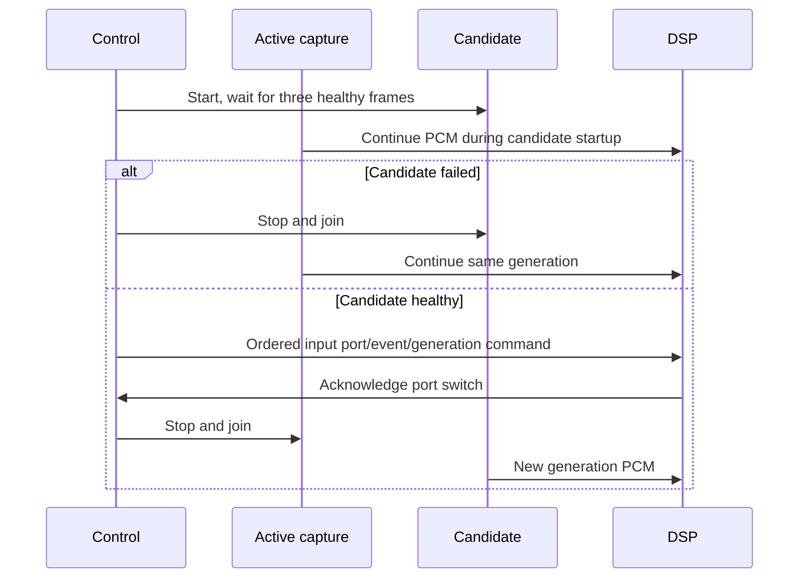

# Warm microphone pipeline (#127)

The implementation has passed local observer, DSP, candidate-switch, allocation,
Windows ducking and 30-minute publication checks. This document does not record
final acceptance of #127: physical device-loss validation remains open before
merge.

The local development SDK build completed all native targets and 34/34 CTest
checks, including GPU tests, in 120.30 seconds. The subsequent targeted mute
fixture also verifies that stopped input clears meter and speaking state.

After publishing SDK `v1.10.0-syrnike.13`, the normal `build:lab` downloaded its
hash-pinned archive and built every target without a local SDK override.
Artifact verification and all 34 CTest checks passed (117.87 seconds, including
six GPU tests). The published binary also passed `microphone-synthetic-aec`
(40.5542 dB ERLE, 13.8224 dB NS attenuation, zero measured heap calls, frame
p50/p95/max 62/79/127 microseconds) and `microphone-mute-cycle` (200 cycles,
zero DSP heap calls, failed-candidate rollback and cleared idle meter).
These release checks do not replace the physical device-loss acceptance gate.

## Audio device registry

`AudioDeviceRegistry` is a native control-thread owner. It enumerates active input
and output endpoints and projects opaque IDs, labels and multimedia defaults.
An absent explicit ID means follow-default; an explicit ID never silently falls
back to another device. Input and output identities cannot cross directions.
Two endpoints with the same label remain distinct. A removed endpoint retains
its identity when it returns to this registry in the same engine process.

The registry admits at most 128 active devices and retains at most 512 historical
endpoint identities. Endpoint strings are limited to 4096 UTF-16 code units and
labels to 1024 UTF-8 bytes. Exhaustion yields `capacity_exceeded`, preserving
previous identity mappings. Enumeration failures yield `enumeration_failed`;
neither outcome resolves an old default from the previous snapshot. An already
running capture is independent of registry refresh and can continue.

Windows notifications only increment an atomic revision in callback-owned state.
The control owner calls `changed()` and refreshes at its bounded control cadence.
Refresh produces at most 128 additions, 128 removals and two default changes.
Notifications during enumeration remain pending for the next refresh. This is a
coalesced device-state projection, not a history of every transient Windows event.
Device loss during capture must also be detected by the capture owner.

| Resource | Owner | Release |
| --- | --- | --- |
| COM apartment, enumerator, collections and devices | Windows registry adapter, control thread | On the same thread, before apartment teardown |
| Notification callback | Adapter retains registration reference | Unregister before releasing callback |
| Notification revision | Shared callback state | Last callback/adapter reference |
| Opaque identity mapping | One engine registry | Registry destruction; no ID eviction/reuse |
| Endpoint resolution value | Native capture/render candidate | Candidate/active owner; contains no COM pointers |

The callback follows Microsoft's [nonblocking notification contract](https://learn.microsoft.com/en-us/windows/win32/api/mmdeviceapi/nn-mmdeviceapi-immnotificationclient)
and [registration lifetime contract](https://learn.microsoft.com/en-us/windows/win32/api/mmdeviceapi/nf-mmdeviceapi-immdeviceenumerator-registerendpointnotificationcallback).

`media_probe enumerate-audio-devices` emits a JSON projection with IDs, directions
and defaults. It omits endpoint paths and labels from collected probe output.
`audio-device-registry` checks replug identity, same-label devices, default
changes, removal, direction isolation, failure and storage exhaustion.

## Remaining stage work

- Physical unplug/replug.

The previous LiveKit APM API allocates 17,000 times for 1,000 warmed frames through
protobuf FFI. A fixed-frame DSP seam passed the SDK's cross-platform CI and was
merged into `native-v2` at `55d7ea89843aa2776b54ca83b0a19c6f08de2f5b`
([SDK PR #9](https://github.com/syrnike13/client-sdk-cpp/pull/9)). The application
pins the published [v1.10.0-syrnike.13 SDK](https://github.com/syrnike13/client-sdk-cpp/releases/tag/v1.10.0-syrnike.13)
and verifies the Windows archive with SHA-256
`23093de4734d8016b430d3788551d9c710fe2f9e9a495fb6baad003fea7b9c27`.
The synthetic fixture measures 40.6 dB ERLE and 13.8 dB
noise suppression with zero measured steady-state heap calls. The processors
are independent, followed by input volume, gate/activity, AGC, exact silence
guard and limiter. See `microphone-dsp-development.json` for evidence and limits.

WebRTC `Initialize()` allocates 1,369 times on renderer-epoch reset. Consequently
the frame callback never calls it: a changed epoch produces typed `unsupported`
AEC while NS and microphone processing continue. Resuming AEC on a new epoch
requires a newly prepared DSP owner. This limitation is explicit, not a successful
AEC reset claim; real rendered-reference integration belongs to #128.

## Warm ownership and control

`MicrophonePipeline` has one joined DSP worker and one serialized control owner.
Warm, publication and meter demands independently retain capture. Mute/PTT and
DSP configuration use one command slot; release/acquire revision acknowledgement
prevents slot reuse while the worker reads it. Configuration commits between
frames. A command timeout retires the pipeline and retains borrowed input
resources until the worker has stopped. Meter snapshots use fixed triple storage
and a maximum 10 Hz producer cadence.



| Resource | Owner | Release |
| --- | --- | --- |
| Active/candidate captures | Pipeline control thread, maximum two | After DSP acknowledgement or joined DSP stop |
| WASAPI client, capture event and MMCSS registration | Each capture's MTA worker | Stop client and release resources before worker completion |
| Capture packetizer and three-frame port | Capture worker and one DSP consumer | After consumer switches away and capture is joined |
| DSP and NS/AEC state | One DSP worker | On joined worker exit |
| Ordered command slot | Control writes, worker reads | Reused only after acknowledgement |
| Output PCM triple buffer | Pipeline state; single publication consumer | After consumer relinquishes port/event |
| Meter triple buffer | DSP writes, control reads | Pipeline destruction |
| LiveKit source, local track and publication | SDK Room task lane, retained by sender state | Ordered unpublish after sender stops submitting |
| Reused SDK audio frame | Publication worker | Joined worker exit |
| Output event | Pipeline state; sender borrows it | Retain pipeline until sender stop succeeds |

`media_lab microphone-mute-cycle` currently checks the warm local pipeline:
200 mute/unmute cycles, DSP updates, exact silence, bounded meter, failed-device
rollback and finite shutdown. It explicitly reports `publicationAttached:false`;
it does not satisfy the neutral-observer/publication acceptance by itself.

`media_lab microphone-publication-failure` runs ten failed publications on the
real SDK task lane without a joined Room. It asserts zero committed tracks,
bounded cleanup, one unchanged capture generation, and continued PCM after each
failure and after returning to meter-only demand. The machine-readable result
is in `microphone-publication-failure-development.json`. Delayed or partially
successful server publication is not covered by this fixture.

`media_lab microphone-device-switch` tries locally enumerated explicit inputs,
checks candidate rollback, and projects default-device notifications over real
Windows endpoints. Explicit selection must ignore default changes; follow-default
must commit healthy PCM from the projected endpoint. The projection never changes
the operating system's default. `microphone-device-switch-development.json`
records the local result and its physical-unplug limitation.

The opt-in `media_lab microphone-default-change` goes further: it temporarily
changes ordinary Windows default input roles through `default_endpoint_proof
--input`, observes actual notifications, and verifies two healthy commits and
restoration of the original defaults. `microphone-default-change-development.json`
records that completed local hardware proof. This command briefly changes the
system's input selection; it is never part of automated CI or the product path.

The separate Node observer supports `MEDIA_LAB_MICROPHONE_REJOIN=1` for one
deliberate leave/rejoin after receiving six seconds of PCM. It requires the same
publication SID on resubscription and keeps deliberate departure separate from
unexpected reconnects. `microphone-rejoin-development.json` records the successful
30-second explicit-input run: two subscriptions to the same publication, one
deliberate rejoin, no unexpected reconnect, 200 mute cycles and NS/volume updates
without reopening input or republishing. Each observer session owns a fresh
`rtc-node Room`; reusing a disconnected Room retained stale participant state.

`microphone-soak-development.json` records the completed 1800-second default-input
publication: 180011 observer frames, one subscription and one unsubscription,
no reconnect, and zero stale sender frames. Handles ranged from 394 to 411 and
threads from 34 to 39. Private bytes increased from about 13.9 MB to 15.3 MB;
this report does not claim constant process memory. Capture/output ports retain
three fixed frames each; the measured DSP worker allocated zero times. Maximum
observer delivery gap was 308 ms during concurrent local builds, so this is not
proof of an uninterrupted sub-100-ms observer scheduling interval.
Sender telemetry now reports latest/maximum frame age and pending frame count
(zero or one). A separate 15-second telemetry probe measured a maximum 21022 us
and no stale frames; its quiet-room acoustic check failed and is recorded
separately rather than substituted for the completed soak.

`media_lab microphone-ducking PID` observes existing foreign-session volume/mute
and PCM from the selected foreign process across baseline, warm, muted, unmuted
and stopped capture. Start `packages/native-media-lab/scripts/foreign-media-tone.ps1`
first, with fresh `ReadyPath`/`StopPath` files, then pass its process ID. The helper
plays a quiet fixed 1 kHz tone and stops when its stop file appears or after
60 seconds. `microphone-ducking-development.json` records unchanged session levels
and process PCM RMS within 0.002 PCM units. This checks the current Windows policy
without changing attenuation preferences or system defaults; it is not an
external acoustic measurement.

## Capture foundation

`MicrophoneCapture` owns one event-driven, shared-mode `IAudioClient2` on a joined
MTA worker. It requests raw input with category `Other`, never the communications
role/category. Raw-mode rejection is reported as `policy_unavailable`; it does
not silently substitute a different processing policy. The worker uses MMCSS
`Audio` and deregisters before completion. Startup requires three consecutive
healthy 10 ms frames within five seconds. A one-second lack of valid PCM is
`no_progress`; shutdown has a caller-supplied finite deadline. Non-cooperative
shutdown requires retiring the containing utility process, never detached cleanup.

Windows converts the endpoint to PCM16, 48 kHz mono. The packetizer owns its
480-sample assembly buffer; the SPSC output owns exactly three complete frames
(writer, exchange slot, reader). An exchange supersedes old pending PCM without
blocking capture or exposing a partly written frame. There is no growing queue
and no borrowed `GetBuffer` pointer leaves the callback. Captured frame counts
and callback timing histograms use fixed atomic counters.

On the locally tested 44.1 kHz default endpoint, `AUTOCONVERTPCM` returns positions
advancing by 441 while converted PCM packets advance by 480 samples (the first
packet contains 446). Therefore device position deltas must not be compared to
converted sample counts. The packetizer checks Windows discontinuity flags,
monotonic device positions and the QPC sample clock. It tolerates 2 ms of QPC
rounding/initial resampler delay and discards partial PCM on larger gaps. A
regression test covers this real endpoint-clock mismatch.

Run `media_lab microphone-capture --seconds 5` for default input or add `--input N`
to select an opaque ID from that lab process's registry. The capture-only report
records frames, RMS, callback histogram (upper bounds 10/25/50/100/250/1000/10000
microseconds, plus overflow), discontinuities, age and resources. This is not a
neutral-observer publication proof or a resource-soak acceptance report. Windows
audio service caches can outlive the first client; lifecycle/soak evidence must
compare warmed steady-state resource samples, not infer a leak-free result from
a single capture run.

`microphone_capture_allocation` compiles the same capture implementation with
lab-only instrumentation. A positive-control CRT allocation validates the heap
interceptor before the ten-second capture run. The measured UCRT heap imports
reported zero allocations/reallocations over 1004 frames; this does not measure
allocations inside Windows audio service/driver modules. The production target
does not compile these hooks. See `microphone-capture-allocation-development.json`.

The same executable's `--device-loss` mode injects `AUDCLNT_E_DEVICE_INVALIDATED`
after 100 real PCM frames, verifies typed `device_lost`, and joins the worker with
client/MMCSS released. `microphone-device-loss-development.json` explicitly marks
this as fault injection. Physical unplug/replug remains unverified because the
user cannot disconnect the microphone during this session.

## Reproducing the lab checks

Build from the repository root with `pnpm --filter @syrnike13/windows-media-engine
build:lab` and `pnpm --filter @syrnike13/native-media-lab build`. The normal build
downloads the pinned SDK release. The development reports below were collected
with an explicitly configured local build of the same SDK change before release.

The standalone native checks are:

```powershell
packages/windows-media-engine/build/Release/media_probe.exe enumerate-audio-devices
packages/windows-media-engine/build/Release/media_lab.exe microphone-capture --seconds 5
packages/windows-media-engine/build/Release/media_lab.exe microphone-mute-cycle
packages/windows-media-engine/build/Release/media_lab.exe microphone-device-switch
packages/windows-media-engine/build/Release/media_lab.exe microphone-synthetic-aec
packages/windows-media-engine/build/Release/media_lab.exe microphone-publication-failure
packages/windows-media-engine/build/Release/microphone_capture_allocation.exe
packages/windows-media-engine/build/Release/microphone_capture_allocation.exe --device-loss
```

For publication, the Node runner starts a local SFU on ports 7886–7888 and mints
temporary credentials for an independent observer and publisher. Point
`MEDIA_LAB_SERVER_EXE` at an existing local LiveKit server executable; the runner
does not download or replace that executable. Set `MEDIA_LAB_AUDIO_BIN` to the
absolute native `build/Release` directory, `MEDIA_LAB_MICROPHONE_REPORT` to an
absolute output filename in an existing directory, and
`MEDIA_LAB_MICROPHONE_SECONDS` to `15`–`1800`, then run:

```powershell
node packages/native-media-lab/dist/run-microphone-lab.js
```

Use `1800` seconds for the soak. The native equivalent is `media_lab
microphone-soak --minutes 30` with `LIVEKIT_URL` and `LIVEKIT_PUBLISHER_TOKEN`
already configured. The observer runner additionally validates received signal,
mute tolerance, and publication continuity.

Optional runner inputs:

- `MEDIA_LAB_MICROPHONE_INPUT`: explicit opaque input ID from the registry.
- `MEDIA_LAB_MICROPHONE_REJOIN=1`: one deliberate observer leave/rejoin.
- `MEDIA_LAB_MICROPHONE_DEVICE_LOSS=1`: prepared physical unplug/replug proof;
  requires an explicit input and at least 30 seconds. Wait for
  `MICROPHONE_DEVICE_LOSS_READY`, disconnect and reconnect that input, and require
  both typed `device_lost` and a recovered healthy generation while retaining
  the same Room/publication. This physical mode has not yet been executed.
