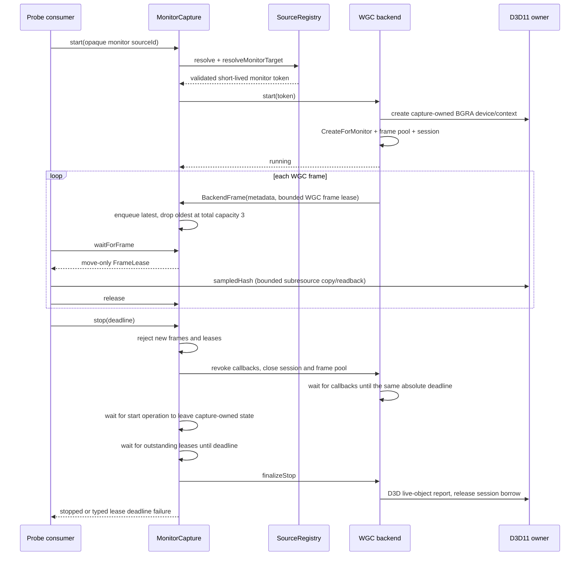

# Isolated WGC monitor capture

Issue #118 adds one local Windows capture path: an opaque monitor source ID is revalidated by `SourceRegistry`, converted to a short-lived native monitor token, opened through `IGraphicsCaptureItemInterop::CreateForMonitor`, and exposed as a bounded frame lease. It is probe-only: LiveKit, Electron, preview, audio, DXGI Desktop Duplication, encoding, and automatic recovery remain outside this module.

## Callback, lease, and stop sequence



The free-threaded WGC callback only validates the frame and transfers its `Direct3D11CaptureFrame` plus surface into the bounded output lease. It does not allocate a full-size texture or issue a GPU copy. Dropping, releasing, or destroying the lease closes the retained WGC frame at the documented release point; hash readback and its bounded `CopySubresourceRegion` happen only on the probe consumer thread. The frame pool has one producer slot beyond the three-frame public bound, so a slow consumer still causes deterministic supersession instead of blocking the producer. The callback captures weak shared state, so a callback arriving after terminal stop cannot dereference `MonitorCapture`.

The output bound counts queued frames plus outstanding leases. When capacity three is full, the oldest queued frame is superseded; if all three slots are leased, the new frame is dropped. A `FrameLease` is move-only, releases its texture automatically on destruction, and returns `already_released` from a repeated explicit release.

## Device and capture-item lifetime

Each production capture instance owns its regular D3D11 device/context, session, frame pool, callback tokens, and per-capture live-resource ledger. D3D11 debug devices are the single diagnostic exception: the Windows debug runtime retains process handles after each device destruction, so one process-scoped debug device is warmed before the measured baseline while every capture keeps a separate ledger and owns no resources from another capture. Immediate-context operations are serialized.

One `GraphicsCaptureItem` is retained per live native target because repeated `CreateForMonitor` also leaves process-scoped WGC bookkeeping. Its cache key contains both stable registry identity and the current `HMONITOR`; disconnect evicts the item through `Closed`, and reconnect with a different native target cannot reuse it. The per-session `Closed` callback emits typed `source_removed`, with no fallback to another monitor.

The probe performs a non-measured warm-up of 64 frames or the measured frame count, capped at 600, before taking its baseline. After every measured session it waits on a resource condition with a five-second deadline, requires threads to return to baseline, and enforces a hard four-handle Windows runtime budget for transient WGC/D3D bookkeeping. The budget is reported in JSON and applies to normal, slow, repeat, and stop-during-start instead of being silently ignored outside the repeat mode. Engine-owned D3D resources use the exact capture-local ledger, while `ReportLiveDeviceObjects` provides the independent debug-layer result.

## Probe contract

```powershell
media_probe capture-monitor --frames 600
media_probe capture-monitor-repeat --cycles 50
media_probe capture-monitor-slow-consumer
media_probe capture-monitor-stop-during-start
```

All modes place `monitor_pattern_fixture.exe` on the monitor selected by the current registry snapshot. The probe owns the fixture through a kill-on-close Job Object, so constructor failure, timeout, or forced probe termination cannot orphan its topmost window. The fixture repaints at approximately 60 Hz with a moving bar, changing full-frame colors, a frame counter, and a clock marker, so content verification does not depend on user activity.

Source IDs remain registry- and process-local by the issue #117 contract. The automated probe enumerates and passes its selected monitor's opaque ID through the same in-process registry seam; an ID copied from another process returns JSON `source_unavailable` instead of plain stderr. Native callers that share the `SourceRegistry` pass the issued ID directly, while the one-shot CLI selects from its own snapshot when `--source` is omitted.

Every mode, including stop-during-start, reports received and superseded frame counts, maximum queue depth, sequence/timestamp checks, sampled hashes, startup/stop duration, process handle/thread deltas, and D3D diagnostics. Hash samples are decimal strings so 64-bit values remain exact in JSON consumers. Debug builds request the D3D11 debug layer automatically; Release probes can request it with `--d3d-debug`. If Graphics Tools is absent, `d3dDebug.status` is `skipped`; if available, the report requires both a successful `ReportLiveDeviceObjects` call and a zero capture-local resource ledger.

Checked Release reports are stored in [`examples/monitor-capture-normal.json`](examples/monitor-capture-normal.json), [`examples/monitor-capture-slow-consumer.json`](examples/monitor-capture-slow-consumer.json), and [`examples/monitor-capture-repeat.json`](examples/monitor-capture-repeat.json).

One absolute deadline covers backend callback drain, completion of an in-flight `start()`, and outstanding frame leases. An unreleased lease returns `frame_lease_deadline_exceeded`; a stuck callback returns `wgc_callback_deadline_exceeded`; and unresolved startup returns `capture_start_deadline_exceeded`. In each case the capture moves to `failed` without unsafe reuse. A probe whose startup cannot cross the deadline terminates its process epoch instead of detaching or joining an unbounded thread. A lease released before the deadline lets stop finish normally.
