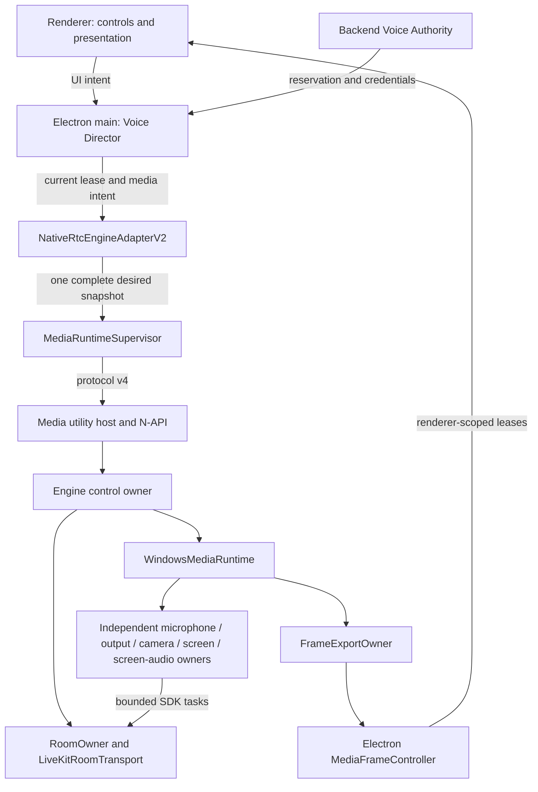

# Windows desktop product integration

Windows desktop uses Engine v2 through one main-process adapter. Voice Director
continues to own membership operations and recovery; a camera, screen, audio,
or presentation failure does not create a voice operation.



Credentials are installed privately as a one-attempt lease. Only its opaque ID
appears in desired state. Backend authority commits membership independently
of track readiness. Move retains Voice Director's break-before-make behavior;
leave revokes publication demand before Room teardown.

## Atomic intent example

This illustrative snapshot requests all four local publications with default
audio and camera devices. The Room, lease, and source IDs are fictional.

```json
{
  "revision": 12,
  "room": {
    "roomId": "channel-example",
    "participantIdentity": "participant-example",
    "credentialLeaseId": "lease-example"
  },
  "microphone": {
    "state": "on",
    "deviceId": null,
    "muted": false,
    "pushToTalk": false,
    "pushToTalkHeld": false,
    "bypassSystemProcessing": false,
    "automaticGainControl": true,
    "noiseSuppression": true,
    "echoCancellation": true,
    "inputVolume": 1,
    "gateEnabled": false,
    "gateThresholdDb": -60,
    "gateAutoThreshold": false,
    "meterDemand": false,
    "retryRevision": 0
  },
  "camera": {
    "state": "on",
    "deviceId": null,
    "profile": "hd720p30",
    "publication": true,
    "previewRendererId": null,
    "retryRevision": 0
  },
  "screen": {
    "state": "on",
    "sourceId": "src_0123456789abcdef0123456789abcdef",
    "width": 1280,
    "height": 720,
    "fps": 30,
    "bitrate": 2000000,
    "audioMode": "process",
    "audioBitrate": 128000,
    "previewRendererId": null,
    "retryRevision": 0,
    "audioRetryRevision": 0
  },
  "output": {
    "state": "on",
    "deviceId": null,
    "deafened": false,
    "volume": 1,
    "users": [],
    "streams": [],
    "retryRevision": 0
  },
  "remoteVideoDemand": [],
  "rendererId": null
}
```

The descriptor generates the intent schemas, C++ models, validators, and N-API
codecs. Each update replaces the complete snapshot. Per-path retry revisions
do not authorize Room reconnect. Microphone mute and PTT change the warm DSP
gate; deafen changes output and effective microphone state. Screen dimensions
and target FPS remain the user's fixed preset while native adaptation changes
only bitrate.

Server mute revokes only microphone publication permission. The adapter keeps
capture warm while that permission is absent and restores the sender in the same
Room when it returns; user mute and PTT continue to gate DSP without republishing.
Camera and screen permissions remain independent. Backend moderation publishes
both the participant display state and the private authoritative snapshot, so
Voice Director observes mute/deafen without waiting for another client action.

## Replay and renderer lifetime

The adapter retains the latest accepted intent, not a command history. A fresh
utility must complete its versioned handshake and reinstall the current credential
lease before replaying that intent. Terminal Room loss is reported to Voice Director,
which obtains a new reservation and credentials through Voice Recovery. Superseded
requests, leases, snapshots, and renderer frame releases are fenced by their
revision or epoch.

Screen source IDs belong to one registry lifetime (#117). Utility loss therefore
requires selecting the screen/window again; the adapter does not guess a new source
from its name or an enumeration position. This appears as an independent
`screen_source_unavailable` state while microphone, camera and output can recover.

Utility retirement uses a Windows process handle retained at spawn, then awaits
kernel-confirmed exit before allowing a replacement. A termination failure stops
runtime recovery and account-runtime replacement. Electron's graceful `kill()`
alone is not the process containment boundary.

Product texture transfer uses Electron's `sharedTexture.subtle` API. Preload
verifies the acquisition sync token even when a frame is closed without drawing,
and acknowledges import separately from GPU release. A transfer deadline never permits
source-slot reuse: main retains the texture until GPU release or destruction of
the receiving frame. A process-wide bound of 68 retained textures covers current
and retired utility/account epochs; late acknowledgements cannot release a new
texture. No Win32 handle is sent to renderer code.

Renderer replacement first installs listeners and then receives current state
and publication inventory. It replaces preview and remote-video demand without
republishing camera or screen or reconnecting Room. Explicit audio/camera IDs
remain stable across utility replacement. Screen source IDs belong to their
registry lifetime, so utility replacement requires explicit source reselection;
expired selections produce `screen_source_unavailable` instead of guessing a
window from a title or handle.

Window lifecycle listeners attach on the first trusted media IPC, after the
BrowserWindow exists. Registration of global IPC precedes window creation in
the desktop bootstrap. Old renderer leases remain bounded while a replacement
gets separate stream admission; release acknowledgements drain both sets.

The SDK worker serializes media operations with Room control. Its media queue
holds at most eight pending tasks, while one reserved Room command takes
priority. The four publication owners can therefore drain concurrently without
turning ordinary admission contention into utility failure. An unresponsive
operation still requires utility retirement; completed failed submissions
return their slots and proceed through ordered cleanup.

## Removed paths and related contracts

The old `NativeRtcEngineAdapter` and its implementation-specific tests are
removed. Windows adapter creation and native media IPC now bind to v2, and
protocol compatibility is exact: no v3 decoder or Windows browser RTC fallback
is retained. Hotkey and overlay runtimes keep their independent lifetimes.

See [resource ownership](RESOURCE_OWNERSHIP.md), [protocol](PROTOCOL.md),
[camera policy](CAMERA.md), [screen audio](SCREEN_AUDIO.md), and
[renderer preview leases](LOCAL_SCREEN_PREVIEW.md). Backend LiveKit API and
protocol versions must remain compatible with the SFU's packet-trailer webhook
fields; the ingress regression covers `PTF_FRAME_ID` for screen publication
and unpublication events.
