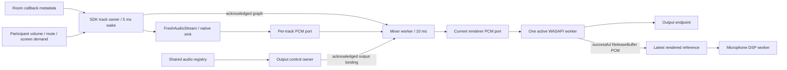
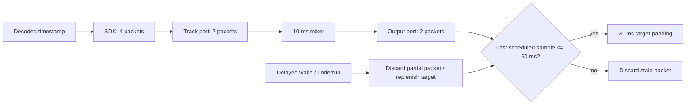
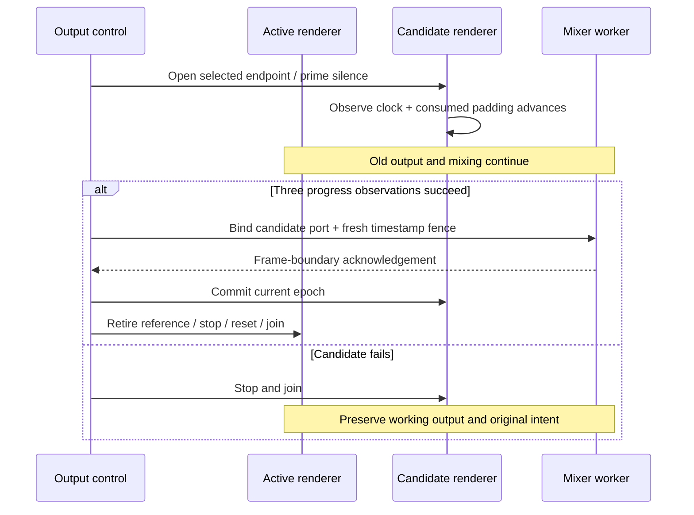

# Fresh remote audio (#128)

This development slice implements track subscription, fresh decoded ingress,
per-participant mixing, a shared WASAPI renderer, and the rendered reference
consumed by #127 microphone DSP. Desktop product wiring belongs to #130.
The opt-in `remote_audio_lab` exercises these owners against the project SFU
and real Windows output endpoints. Development reports use SDK 14 development
binaries; they are not evidence of a published SDK release.

## Ownership

SDK callbacks only update bounded publication metadata. They do not decode,
mix, open devices, or wait for subscription/mixer acknowledgements. The SDK
reader owns stream construction, reads, subscription calls and destruction.
It validates canonical participant identity, publication SID, kind and source;
it retires a removed PCM generation before replacing the mixer graph.

Microphones are desired while connected. Screen audio requires a demand for
that participant's exact current screen-video SID. A camera SID or removed
screen SID does not satisfy the demand. User volume and local mute survive
publication replacement and Room attachment; the screen demand remains an
explicit caller-owned intent. A failed subscription retires only its track.

Call `attachRoom` before connect when the caller owns the Room directly, then
`seedConnectedRoom` after connect. The bounded SDK publication snapshot also
handles publications that predate the join. Call `detachRoom` and await its
acknowledgement before releasing the Room. The lab using `LiveKitRoomTransport`
attaches after successful connection and seeds before starting subscriptions.

The mixer has separate graph and output command slots. Each slot holds current
and pending owners until the worker acknowledges the command. The realtime
worker borrows raw PCM ports; final reference release happens on control owners.
Graph changes cannot overwrite a concurrent output-switch command. A timed-out
command retires the worker and retains both sides until it has joined.

## Capacity and freshness

All internal PCM is 48 kHz stereo, 480 frames (10 ms) per packet. A packet is
1920 bytes of PCM. Storage is fixed; track churn does not create a history queue.

| Boundary | Capacity | Overload behavior |
| --- | --- | --- |
| Native decoded sink | 4 packets per track | Drop oldest; never wait on contention |
| Track-to-mixer port | 2 effective packets; 4 slots allocated | Drop oldest or drop on contention |
| Active mixer inputs | 32 tracks | Reject excess publication admission |
| Mixer-to-renderer port | 2 effective packets; 4 slots allocated | Drop oldest or drop on contention |
| Renderer preparation | 960 stereo frames | Replenish target padding only |
| Renderer partial packet | 1 packet | Discard on stale age, delayed wake or underrun |
| Echo reference | 3 mono slots, latest only | Retire with renderer epoch |
| Publication metadata | 64 entries, at most 32 audio tracks | Reject excess entries |
| Participant controls / screen demands | 128 / 32 | Reject excess controls/demands |

At full audio capacity the decoder queues hold at most 245,760 PCM bytes;
the effective track queues hold 122,880 bytes (245,760 bytes allocated).
These bounds exclude WebRTC's own codec/network buffers. At most two renderer
instances exist during a switch, each with its own bounded projections and
WASAPI buffer. Windows buffer sizes above one second are rejected; actual
scheduled padding is limited to 20 ms regardless of the allocated device buffer.

The maximum decoded-to-scheduled-sample age is **60 ms**, measured conservatively
through the last sample of each copied fragment. Target padding is **20 ms**.
The SDK preserves monotonic decoded time, including native format conversion;
the application never replaces it with a later queue timestamp. Mixing carries
the oldest contributing audible source timestamp. Muted/deafened inputs are
still consumed so they do not build replay debt.

These capacities are ceilings, not latency targets added together. A delayed
consumer discards old packets instead of playing every queued frame. Each queue
operation makes one atomic try attempt and examines at most four packet headers.
The mixer processes at most 32 fixed packets per wake and coalesces missed timer
periods. Limiting applies a common gain to both stereo channels for a frame's
peak above 32,112, preserving channel balance. User gain is linear 0–2.

## Output transaction and recovery

`IAudioClient2` uses shared event-driven rendering, 48 kHz stereo PCM with Windows
format conversion, and `AudioCategory_Other`. Follow-default uses the multimedia
role. Successful `ReleaseBuffer` alone is insufficient for startup health: three
advances in device clock and calculated consumption are required. No progress
for 500 ms produces a typed failure. Recovery is local to the output owner:
at most three attempts, one second apart, reset by a new registry revision or
explicit selection. Output recovery never reconnects a Room or changes capture
or microphone publication.

The echo port contains only downmixed PCM accepted by `ReleaseBuffer`, together
with stream delay, epoch and sequence. Stopping/failing the renderer retires this
port immediately. Microphone processing then reports `unavailable` and continues.
Changing renderer epoch reports `unsupported` when the SDK APM cannot reset its
echo history without allocation on the DSP owner. Independent NS and publication
continue; this is an explicit current limitation, not an AEC reset success.

## Development evidence

| Report | Result |
| --- | --- |
| `remote-audio-multiparticipant-development.json` | Two distinct participants; 0/50/100/200%, local mute, deafen and restoration |
| `remote-audio-routing-development.json` | 17 phases: exact screen demand, adjacent-source continuity during replacement, volume persistence and receiver Room replacement |
| `remote-audio-reader-delay-development.json` | 250 ms reader delay; 44 SDK drops; observed app queue ≤2; scheduled age ≤45.405 ms |
| `remote-audio-output-stress-development.json` | Physical endpoint switch; failed and stalled candidate rollback; 250 ms wake delay; 513 ms no-progress detection and fresh recovery |
| `remote-audio-default-removal-development.json` | OS endpoint disable/return; three healthy epochs; all three original default roles restored |
| `remote-audio-aec-development.json` | 1500 real rendered-reference frames; 40.5022 dB synthetic ERLE; loss becomes unavailable |
| `remote-audio-echo-publication-development.json` | One capture and publication across output loss/recovery; unavailable then typed unsupported AEC |
| `remote-audio-ducking-development.json` | Default and nine explicit outputs; foreign session/PCM levels unchanged within 3% |
| `remote-audio-soak-development.json` | 1800 s / 359,972 decoded frames; p95 ≤50 ms, maximum 56.911 ms, no underruns |

The default-removal test is a real programmatic Windows endpoint disable, not a
physical cable-unplug test. Its independent helper restores endpoint visibility
and all original default roles even if the observer fails. Do not terminate the
helper during a run. The 30-minute soak's process memory changed from 12,656,640
to 13,180,928 bytes, handles from 386 to 388 and threads from 33 to 29.

The SDK correction preserves local sender identities while signalling current
track identities to the SFU; transceiver reuse remains enabled. The routing
report uses that corrected development binary. Final SDK release verification
remains pending.

## Running the probes

Build the opt-in native lab targets and `@syrnike13/native-media-lab`. Run the
TypeScript orchestrator with `MEDIA_LAB_SERVER_EXE`, `MEDIA_LAB_AUDIO_BIN`,
`MEDIA_LAB_REMOTE_AUDIO_REPORT` and `MEDIA_LAB_REMOTE_AUDIO_SECONDS` (23–1800).
`MEDIA_LAB_REMOTE_AUDIO_MODE` accepts `mix`, `delay`, `routing` or
`echo-publication`. It launches a disposable loopback-only SFU with fresh keys,
native publishers and receiver processes; output/error reports are retained.

Native commands are `output-probe 3`, `output-stress`, `aec`, `ducking PID`,
and `default-removal`. The last command intentionally disables the current
default output for five seconds and requires a second active endpoint. The
ducking command requires a stable, audible foreign media process. Delay and
client-stop injection is compiled only into the lab library variants, never
the production audio libraries. Physical audio and device mutation probes are
opt-in and are not ordinary hosted-runner tests.
