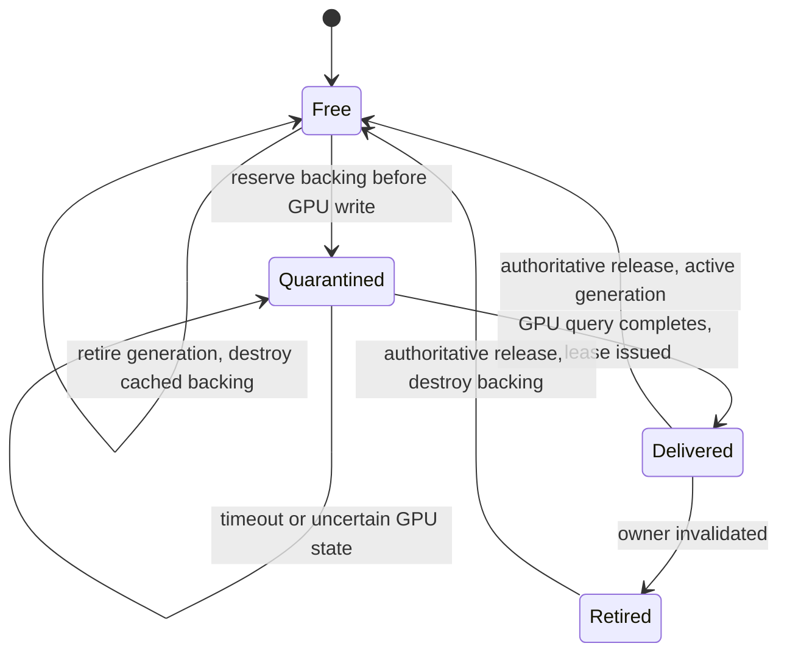

# Remote video receive and Electron texture bridge (#122)

Implemented on Windows, 2026-09-05. This is the opt-in native Media Lab receive
slice, not the Voice UI cutover. The application pins published SDK
[`v1.10.0-syrnike.4`](https://github.com/syrnike13/client-sdk-cpp/releases/tag/v1.10.0-syrnike.4)
at commit `7e3a9465733666f6fa463c58d842e3702ed2e646`. Its Windows archive SHA-256
is `06ea330c76bd736fbfc5c46dc997c1d2f965e822a70d86b39bb84b590d7741c1`.
The [SDK blocker history](REMOTE_VIDEO_SDK_BLOCKER.md) records the original
local candidate and the reproducible release source.

## Ownership and bounds

`native/src/video/remote_video_track.*` owns one explicitly selected remote
participant/track name. The lab supplies demand independently of Voice. It
retains the actual publication object and SID, matches subscription callbacks
by object identity, and fences decoded callbacks by revision. Publication,
decoded frame and exported texture have separate lifetimes. The transport
stops its observer before destroying the Room or shutting down the SDK.

SDK callbacks only replace bounded control values. Subscription and teardown
run on an owner worker. A separate reader consumes a capacity-one BGRA
`VideoStream` into one newest-frame slot. The worker accepts increasing source
timestamps and rejects frames waiting more than 250 ms after reader ingress.
There is one unsent output lease. Replacing that unsent output can immediately
return it because no external consumer has seen it.

`SharedTexturePool::processPool()` owns four slots across all track owners,
including retired generations. Its fixed registry permits 16 active owner
generations; retiring one does not invalidate another. Dimensions are bounded
by 3840x2160, and estimated texture backing has an independent 256 MiB ceiling.
The estimate rounds BGRA row pitch to 256 bytes and allocation size to 64 KiB:

| Size | Bytes per slot | Four slots | MiB |
| --- | ---: | ---: | ---: |
| 1920x1080 | 8,323,072 | 33,292,288 | 31.75 |
| 2560x1440 | 14,745,600 | 58,982,400 | 56.25 |
| 3840x2160 | 33,226,752 | 132,907,008 | 126.75 |

This budget covers allocated pool textures, including cached free, retired and
quarantined backing. It is an estimate, not driver memory measurement; SDK
decoder buffers, CPU BGRA frames and Electron compositor allocations are
outside this pool budget. No allocation grows the slot count.



The worker uploads to a shared NT-handle D3D11 BGRA texture under the process
device context mutex. A GPU event query must complete before export. A 200 ms
query deadline or failed keyed-mutex acquisition quarantines the slot; elapsed
time never grants permission to reuse it. Quarantined backing remains counted
until the utility process exits. There is no detached reader thread: a stuck
SDK teardown requires containment by the outer process deadline.

## Cross-process lease protocol

`apps/desktop/src/main/media-runtime/remote-video-bridge.ts` is the reusable
main-side controller. The lab utility owns native media. The lab main addon
only duplicates/closes NT handles; renderer receives opaque, versioned lease
metadata and an Electron imported texture, never a native pointer or D3D device.

```mermaid
sequenceDiagram
    participant N as Native utility / pool
    participant M as Main bridge
    participant E as Electron GPU lifetime
    participant R as Preload / renderer
    N->>M: v1 lease (generation, sequence, slot, SID, dimensions, local handle)
    M->>E: duplicate handle and import texture
    M->>R: sendSharedTexture + metadata without native handle, hostEpoch
    R->>R: validate epoch/generation/sequence, explicitly draw
    R->>M: presentation diagnostic (not release authority)
    R->>E: VideoFrame.close + imported texture.release
    M->>E: release main imported reference after transfer settles
    E->>M: allReferencesReleased
    M->>N: release exact generation/sequence/slot (retry until ACK)
    N->>M: ACK; reject duplicate or mismatched tuple
```

The bridge retains at most four entries. A timeout/rejection from texture
transfer is not GPU-release evidence. The entry remains quarantined until
Electron proves all references released. A generation change invalidates
presentation but does not force-release exported backing. An old generation's
valid release may destroy its retired texture; it cannot release a newer lease
in the same slot. The immutable driver captures one utility endpoint, fencing
late callbacks from future process epochs. Renderer reload, crash or close
does not reconnect the Room.

Electron's release contract is documented in
[sharedTexture](https://www.electronjs.org/docs/latest/api/shared-texture) and
[SharedTextureImported](https://www.electronjs.org/docs/latest/api/structures/shared-texture-imported).

## Reproduce

Build with the published SDK pin. The normal build downloads and verifies it:

```powershell
Remove-Item Env:MEDIA_LAB_LIVEKIT_SDK_ROOT -ErrorAction SilentlyContinue
pnpm --filter @syrnike13/windows-media-engine build:lab
pnpm --filter @syrnike13/desktop build:video-lab
$env:MEDIA_LAB_SERVER_EXE = '<absolute path to local livekit-server.exe>'
$env:VIDEO_LAB_SCENARIO = 'normal'
$env:VIDEO_LAB_SECONDS = '610'
pnpm --filter @syrnike13/native-media-lab viewer
```

The runner starts a disposable loopback Room/server with random credentials,
short-lived tokens, an isolated Electron profile and a controlled 1920x1080
H264 source targeting 60 fps (8 Mbps, no simulcast). It cleans up its children
and temporary files. It does not use production credentials. Local runs used
upstream LiveKit v1.13.6. The source target is not a guarantee of 60 presented
frames/sec: real encoding, decoding, newest-frame replacement and renderer
sampling may drop frames.

Use `stall/45`, `slow/22`, `reload/18`, `crash/18`, `close/18`, `cycles/52`,
and `replace/20` for scenario/duration. Stall holds all four renderer references
for 30 seconds, then discards them before presenting fresh frames. Slow holds
references for 150 ms. Cycles disable/enable demand 30 times and inject a late
decoded callback through the real revision check at each transition. Replace
unpublishes the controlled track, pauses two seconds and publishes a new SID.

Reports default to ignored `packages/native-media-lab/artifacts/remote-video-<scenario>.json`.
`VIDEO_LAB_REPORT` can select another path. `verify-viewer.mjs` validates the
scenario's progress, duration and resource invariants in addition to exit code.

## Diagnostics and evidence

Reports sample once per second. `decoded` counts reader observations;
`accepted` counts successful pool uploads; `dropped` counts rejected pool
uploads, not SDK/newest-slot drops; `presented` counts renderer draw ACKs, not
physical display scanout. `decoded - presented` therefore includes several
different reasons and is not a single error counter.

Pool state counts, estimated backing, oldest outstanding lease age, stall age,
retired generations and release latency are reported. Release p50/p95 use the
last 1024 returned leases; max is lifetime. Ingress-to-draw p50/p95 also use a
rolling 1024 samples and the same Windows steady clock across processes. They
exclude network and decode time and do not measure end-to-end source latency.
Duplicate control retries may increment `invalidReleases`; they cannot recycle
a current lease. Final samples are taken after renderer destruction and demand
off, while Room remains connected.

Machine-readable results and sampled long-run trend are in
[remote-video-acceptance.json](examples/remote-video-acceptance.json).
All scenarios must end with zero pool backing and zero pending bridge leases.
The 30-second stall must keep backing flat while decoding continues and uploads
stop at four held slots, then resume fresh presentation.

The 610-second run presented 31,563 frames. Backing remained 33,292,288 bytes
after warmup. Mean rolling p95 in the first/last 60 steady-state samples was
19.94/20.09 ms; a transient rise to 53.07 ms recovered, without a rising backlog.
Final p95 was 19.74 ms. During stall, accepted uploads stayed at 177 while
decoded observations continued from 244 to 1,870; presentation resumed with
final p95 19.61 ms. All eight scenarios passed the report verifier. A separate
20-second run verified the isolated-profile runner and cleanup (956 frames).
Electron can report cleaning up a dangling imported reference when a renderer
is destroyed; the pool still waits for its authoritative release callback.

Validation also covers the native fixed pool with actual D3D allocations,
multiple active owners, retirement, invalid/duplicate/late releases and 30
allocation cycles. The D3D debug layer reports no live textures after cleanup;
the same pool test passes under MSVC AddressSanitizer. This is pool-focused
ASan/debug-layer coverage, not instrumentation of Electron or the SDK decoder.
The desktop bridge tests exercise authoritative release/ACK, transfer timeout,
schema bounds and epoch-safe metadata. Voice subscription reconciliation remains
later integration work; the SDK prerequisite is now published and pinned.
