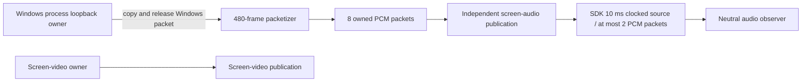

# Screen audio (#125)

Capture, independent publication and desired-state ownership are implemented.
The local acceptance matrix is recorded in
[screen-audio-acceptance.json](screen-audio-acceptance.json); issue closure follows
the reviewed merge rather than the existence of these local results.

## Capture contract

Both modes require Windows build 20348 or later and successful activation of
`VIRTUAL_AUDIO_DEVICE_PROCESS_LOOPBACK`. Older systems report `unsupported`.
`include_process_tree` includes the selected window's process and descendants.
`system_exclude_client` excludes the **desktop main process and its descendants**,
including utility playback. The caller must provide the validated main-process
identity, not merely the current utility PID. Neither mode silently changes to
endpoint system loopback. The virtual endpoint spans rendering endpoints;
changing the default output does not intentionally select a different capture
source. Device invalidation remains an explicit capture failure.

Source resolution retains a process handle, validates its creation time and
rechecks the window registry identity. Process exit is observed through the
process handle, independently of video and Room.

The capture thread initializes COM in MTA, waits on sample/stop/process events
and releases each Windows buffer on the same thread that acquired it. It never
calls the SDK. Asynchronous activation retains its own completion state, with
at most one unresolved activation per process; late completion cannot write
into a replacement owner. Activation has a 5-second deadline.

## PCM and clocks

Windows shared-mode conversion produces PCM16, 48 kHz, stereo. Packetization
uses fixed 480-frame / 960-sample arrays (10 ms). The queue owns eight packets;
on overflow the oldest is replaced. Admission and consumption reject packets
older than 100 ms. Generation checks reject late capture after restart or stop.
Discontinuity discards partial packets; silent input produces zeros, and invalid
QPC timestamps are dropped rather than replaced by wall time.

The first sample's `IAudioCaptureClient::GetBuffer` QPC position is already in
100 ns units. Packet offsets are computed from sample counts at 48 kHz. On
Windows this shares the QPC clock used by screen capture and `steady_clock`.
No wall-clock offset or extra queue is used to correct A/V drift.

The SDK source uses its fixed 10 ms clocked mode: its native storage is bounded
to two 10 ms packets and it emits silence when input is absent. The zero-buffer
mode was rejected by the slow-ingress observer test because stopping its audio
clock caused persistent receiver delay after capture resumed. No buffer grows
to smooth drift. After a publication-worker gap over 100 ms, the ingress queue
discards all but the latest packet; freshness is checked again immediately
before the SDK call. The SDK callback deadline is 100 ms, with an explicit typed
timeout and utility-retirement requirement if native completion is uncertain.

## Independent lifecycle

`ScreenAudioOwner` consumes monotonically increasing desired revisions.
An absent intent is audio off; on contains a mode and validated process identity.
Equivalent healthy intents do not republish. A newer explicit intent may retry
a recoverable failure. There is no autonomous retry or Room/video recovery path.
An uncertain SDK timeout permanently fences that owner from replacement work.

Capture activation precedes publication and both must succeed before `running`.
Superseded startup drains its own session before the latest revision can commit.
Stop drains Windows capture and then its own publication against one deadline.
The session port exposes no video-stop or Room-disconnect method.

Closing a window stops that video's publication. Audio continues while the
explicit audio intent remains on and its process remains alive; process exit
instead reports `target_exited` and terminates only audio. A high-level stop of
the complete screen session must stop both independent paths.

References: [process-tree semantics and minimum build](https://learn.microsoft.com/en-us/windows/win32/api/audioclientactivationparams/ne-audioclientactivationparams-process_loopback_mode),
[buffer ownership and QPC units](https://learn.microsoft.com/en-us/windows/win32/api/audioclient/nf-audioclient-iaudiocaptureclient-getbuffer),
[Microsoft application-loopback example](https://github.com/microsoft/Windows-classic-samples/tree/main/Samples/ApplicationLoopback).

## Reproducing acceptance

Build the opt-in native lab with `pnpm --filter @syrnike13/windows-media-engine
build:lab` and the observer with `pnpm --filter @syrnike13/native-media-lab build`.
The default SDK pin is the published `.6` archive; a private local SDK build is
not required. Then run `node packages/native-media-lab/dist/run-screen-audio-lab.js`
with these explicit environment variables:

| Variable | Meaning |
| --- | --- |
| `MEDIA_LAB_SERVER_EXE` | Repository LiveKit server executable |
| `MEDIA_LAB_AUDIO_BIN` | Absolute native lab Release directory |
| `MEDIA_LAB_AUDIO_REPORT` | Absolute observer JSON destination |
| `MEDIA_LAB_AUDIO_DURATION_MS` | 30,000 normally; 610,000 for ten-minute drift |
| `MEDIA_LAB_AUDIO_SCENARIO` | `sync`, `system`, `process-isolation`, `slow-source`, `audio-stop`, `video-stop`, `audio-loss`, `source-close`, `audio-cycles`, or `default-output` |

Use 60,000 ms for `audio-cycles` and 40,000 ms for `slow-source`. The latter
injects two 250 ms stalls into only the publication worker, while Windows
capture keeps running. Its full observation interval must meet the normal A/V
and age targets. It also requires actual superseded packets and a maximum
ingress depth no greater than eight.

`system` publishes a separate remote reference voice and actually renders it
inside the excluded native client. The fixture's tone IDs and phase differ
from that voice. `process-isolation` adds a separate audible foreign process
at a different phase; extra captured pulses cause matching failure.
`audio-loss` kills only a harness-owned audio target. `source-close` closes
only the harness-owned fixture window while its process keeps rendering.

The opt-in `default-output` scenario additionally requires
`MEDIA_LAB_ENDPOINT_PROOF_HELPER` and `MEDIA_LAB_ENDPOINT_PROOF_TARGET`.
The standalone `default_endpoint_proof` helper temporarily changes the console
and multimedia defaults for five seconds, verifies them, and restores both.
It does not change the communications default. This uses the undocumented
[PolicyConfig interface](https://github.com/xenolightning/AudioSwitcher/blob/master/AudioSwitcher.AudioApi.CoreAudio/Internal/Interfaces/ComInterfaceIds.cs)
only in an explicitly invoked local proof, never in the product or automatic CI.
The harness waits for its restoration even if another proof process fails.

`node packages/native-media-lab/dist/run-audio-capture-lab.js` uses
`MEDIA_LAB_AUDIO_BIN` and `MEDIA_LAB_AUDIO_CAPTURE_REPORT` to exercise 30 capture
lifecycles and a parent with an audible descendant. Only owned fixtures are
created or terminated. The first two cycles cover Windows cache initialization;
the remaining cycles permit at most two handles of variation and require zero
live capture clients/threads after every stop.

## Oracle and limits

The fixture renders an atomic visual barcode and a frequency-coded 100 ms pulse
each second. Its visual clock follows the output device's played sample count.
The recorded ten-minute and initial lifecycle proofs used the original 50 ms
plateau. The final short isolation matrix uses 100 ms to span multiple frames
at the 30 fps profile; the rising-edge clock and latency limits are unchanged.
The publisher records the captured pulse's QPC position; the neutral observer
uses the same machine's monotonic clock and decodes audio and video independently.
Audio age is capture-to-observer, while the video watermark reports video age.
The observer also records delivered PCM sample count and inter-delivery gaps;
these are decoded-output continuity metrics, not a claim of zero RTP loss or PLC.

Full-run p95 absolute skew and audio/video age targets are 150 ms. A 610-second
run requires more than ten minutes of paired pulses and at most 50 ms change
between the first and last minute's median skew. At least 90% of each channel's
pulses in the common audio/video observation interval must match. The interval
uses the matcher's existing 500 ms radius at its edges; audio delivered before
video startup does not become a fictitious missing visual pulse. Minimum count
and duration gates still reject insufficient startup coverage. Off/loss
scenarios additionally require continuing frames;
video-off/window-close require at least three audible pulses after video ends,
so decoder-generated silence cannot pass as continued audio.

The volume probe reads active foreign sessions every control iteration and
after teardown. It never writes their level, mute, category or ducking settings.
Reference playback runs in normal multimedia mode. This covers the screen-audio
matrix, not the microphone/AEC/communications-render pipeline deferred to #127.

Deterministic tests cover fragmented/silent/discontinuous packets, invalid QPC,
generation fencing, 60,000 producer packets against a stalled consumer, backlog
discard on recovery, superseded startup, explicit retry, sticky retirement and
concurrent stop. SDK AudioSource timeout regression passed 100 consecutive runs.

## Recorded results (2026-09-05)

| Observer scenario | p95 absolute skew | p95 audio age | p95 video age |
| --- | ---: | ---: | ---: |
| System exclude + real own reference playback, 610 seconds | 81.83 ms | 74.92 ms | 18 ms |
| Process tree with a separate foreign audio fixture | 65.06 ms | 72.06 ms | 19 ms |
| Two 250 ms publication stalls, full 40-second interval | 48.82 ms | 66.93 ms | 19 ms |
| Actual default-output change and restoration | 60.60 ms | 68.23 ms | 18 ms |

The ten-minute run measured 46.71 ms additional drift, 61,035 delivered audio
frames and zero delivery gaps over 100 ms. The maximum delivery gap was 25.46 ms.
All scenarios kept the existing Room without reconnect. The stall run dropped
48 old packets, peaked at eight ingress packets and submitted PCM no older than
13.32 ms at SDK completion.

The 30 complete audio publication cycles produced exactly 30 audio subscriptions
and one continuous video subscription. Each stop returned to zero capture
clients/threads/PCM. Process handles were 808 initially and remained 810 from
cycle 10 through 30. The separate ASan capture matrix exercised 30 lifecycles
and captured an audible child from its silent parent. Release CTest passed
25/25; ASan audio tests passed 2/2; concurrent-stop regression passed 20 repeats;
Media Lab tests passed 22/22. Generated protocol and staged SDK artifacts passed
verification.

### Windows volume/reference matrix

| Scenario | Active foreign sessions observed | Level/mute changes |
| --- | ---: | --- |
| System exclude with own remote playback (610 seconds) | 3 | 0 / 0 |
| Process-only plus foreign fixture | 4 | 0 / 0 |
| Slow publication | 3 | 0 / 0 |
| Default-output transition | 3 | 0 / 0 |
| Thirty complete audio lifecycles | 3 | 0 / 0 |
| Independent audio/video stop and source-window close | 3 | 0 / 0 |
| Audio target exit while video remains | 4 | 0 / 0 |

The system test confirmed 3,666 audible reference packets actually submitted
to local playback inside the excluded process. None appeared as extra coded
audio at the screen observer. Volume snapshots describe the observed normal
multimedia sessions; they are not a claim about the future communications/AEC
pipeline or every third-party application's ducking policy.
