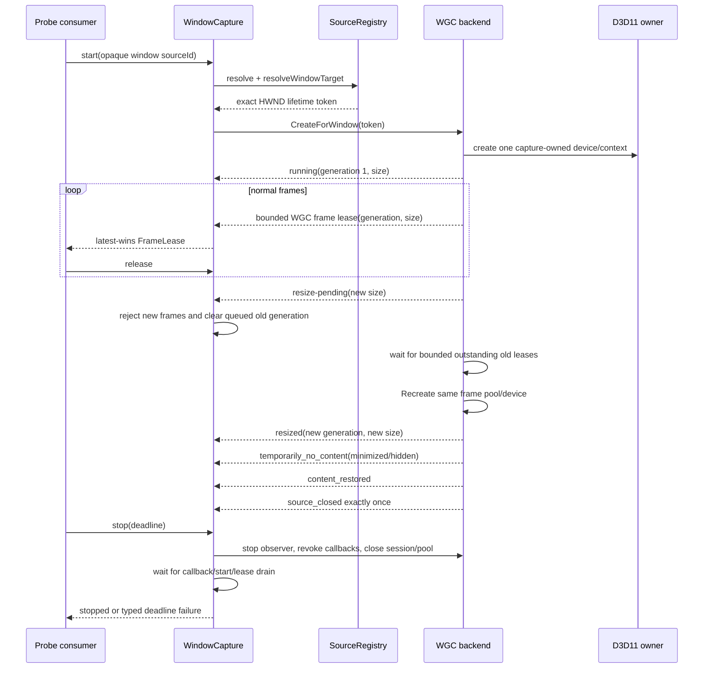

# Isolated WGC window capture

Issue #119 extends the probe-only Windows capture boundary from monitors to one exact window lifetime. An opaque window source ID is revalidated by `SourceRegistry`, resolved to an internal `WindowTargetToken`, opened through `IGraphicsCaptureItemInterop::CreateForWindow`, and exposed through the same move-only, three-frame `FrameLease` contract as monitor capture. LiveKit, encoding, Electron, preview, audio, DXGI fallback, replacement-window search, and automatic recovery remain outside this module.

## Resize, no-content, close, and stop sequence



## Identity and terminal behavior

`SourceRegistry::resolveWindowTarget` performs a complete window reconciliation immediately before returning an HWND. The token contains the full registry identity, including process creation, owner thread, class, and WinEvent lifetime epoch; a recycled numerical HWND therefore produces a different opaque source ID. `WindowCapture` resolves the token again after WGC creates the capture item but before publishing `running`, which closes the handle-reuse interval during startup. Capture never searches by title or process and never switches to a replacement window.

`GraphicsCaptureItem::Closed` and explicit destruction observation both converge on one terminal `source_closed` event. The registry revalidates the original identity when that terminal signal arrives, so an observed replacement is recorded as the typed `source_replaced` reason without switching capture to the new window. Terminal close starts and finalizes backend cleanup even when the consumer never calls `stop`; the close probe waits for the diagnostic `cleanupCompleted` flag before its idempotent stop call. A concurrent explicit stop joins the same serialized cleanup, so close, stop, and resize can commit terminal completion only once. Start returns `source_closed` for a destroyed identity, `source_replaced` for a stale lifetime, `source_unavailable` for an unknown process-local ID, and `source_resolution_failed` when validation infrastructure fails.

## Generation-fenced resize

Frame metadata includes a monotonically increasing generation. When WGC reports a different `ContentSize`, the backend first emits an internal resize-pending transition; `WindowCapture` rejects subsequent old frames and clears its queued leases. The backend retains at most the three already-issued leases, discards incoming frames while they drain, then calls `Direct3D11CaptureFramePool::Recreate` on the same device and pool owner. Only after Recreate succeeds does it publish `resized` and accept frames for the new generation.

This keeps old-size frames observable only through their old generation token and prevents unbounded retired frame pools. A consumer that retains an old lease cannot create more retired generations: resize waits at the single pending generation boundary, and ordinary stop still enforces the same absolute lease deadline as monitor capture.

## Minimize and hidden windows

WGC does not provide a terminal signal for an ordinary period without frames. A joinable, capture-owned observer reports `temporarily_no_content` from explicit Win32 minimized/visibility state and `content_restored` when that state clears; it does not infer failure from an arbitrary frame timeout and never restarts the capture session. WGC may also expose a transient minimized content size, which is handled as an ordinary fenced resize without publishing mixed-size frames.

The observer waits on a condition variable with a 25 ms bound and is joined before session teardown. It captures shared state rather than a raw backend pointer. A minimized or hidden window can remain without frames indefinitely; only close or a typed platform error is terminal.

## Fixture and probe contract

`source_window_fixture.exe` draws a changing full-frame color, moving bar, frame counter, and clock marker. Its bounded stdin protocol drives sequential and rapid-burst resize, minimize/restore, hide/show, cross-monitor movement, close-after-N, destroy/recreate, and a 64-attempt recycled-HWND test. Test hooks pause the real WGC callback immediately before frame delivery or frame-pool `Recreate`, so the close-during-callback and stop-during-resize races are reproduced rather than inferred from an outstanding consumer lease. The probe owns the fixture through a kill-on-close Job Object.

```powershell
media_probe capture-window --frames 600
media_probe capture-window-resize --fixture
media_probe capture-window-minimize --fixture
media_probe capture-window-close --fixture
media_probe capture-window-repeat --cycles 50
```

Every mode emits generation and size transitions, frames per size, no-content intervals, terminal reason and count, queue depth, sequence/timestamp/hash checks, D3D live/peak diagnostics, and process handle/thread baselines. The resource baseline is taken after a mode-specific warm-up: three lifecycle sessions for repeat, one resize for resize mode, and one `Closed` for close mode. This excludes Windows' bounded lazy initialization while still detecting incremental growth across the measured 50 cycles, 30 resizes, or subsequent close. Frame dimensions must match the `running` or `resized` event for their generation. Cross-monitor movement is `tested` when two monitors are present and otherwise `skipped_insufficient_monitors`; a different-DPI transition is independently reported as `tested`, `skipped_no_mixed_dpi`, or `skipped_insufficient_monitors`. Handle reuse is accepted only when the fixture reports `recycled=1`; otherwise the result is `skipped_no_reuse`, not a pass. Debug builds request the D3D11 debug layer automatically, and a missing Graphics Tools installation remains a typed `skipped` result.

The checked-in Release evidence covers [normal 600-frame capture](examples/window-capture-normal.json), [a rapid burst, 30 sequential fenced resizes, a real callback/Recreate stop race, and cross-monitor move](examples/window-capture-resize.json), [minimize and hide recovery](examples/window-capture-minimize.json), [one terminal close during a real frame callback plus an honest HWND-reuse attempt](examples/window-capture-close.json), and [50 start/stop cycles](examples/window-capture-repeat.json).

The process-scoped capture-item cache is bounded at 64 exact live identities, which avoids accumulating WinRT process handles when the same live window is captured repeatedly. `Closed` marks its entry without releasing the item inside its own callback; the next item acquisition prunes closed entries, and the final bounded entry is reclaimed at probe/utility process exit. Session-owned references are still released by the observer after callback drain.
