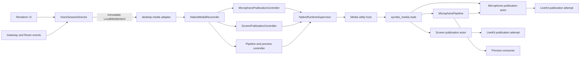
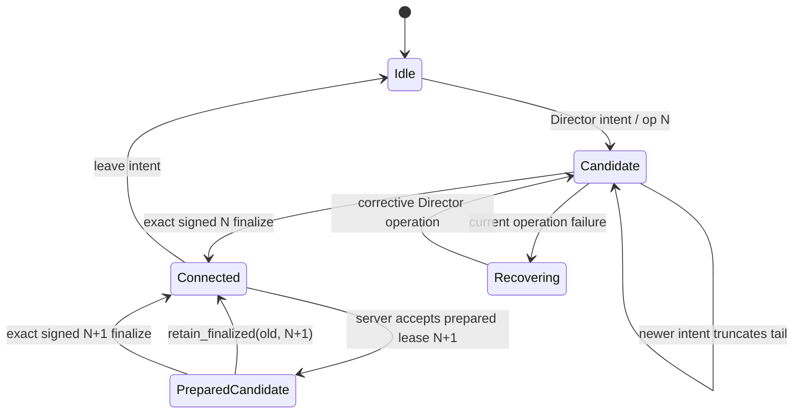
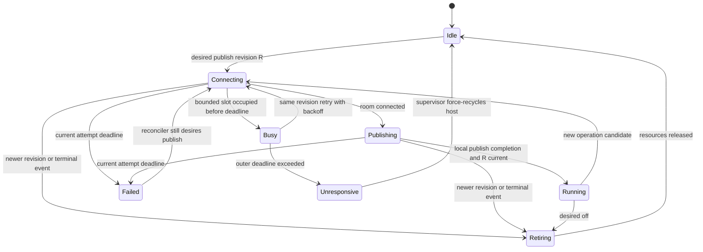

# Native media control plane redesign

- **Status:** Accepted; implementation/hardening in progress
- **Date:** 2026-07-10
- **Updated:** 2026-07-10 after reservation/retain and bounded-actor cutover
- **Scope:** voice operation ownership, native microphone/screen publication,
  Electron supervision, Windows native actors and LiveKit lifecycle
- **Evidence run:**
  `native-media-2026-07-10T06-24-04-317Z-b29b96c5-878c-433e-9959-d18e18c5a459`
- **Related decisions:** [ADR-0001](../adr/0001-voice-intent-director.md),
  [ADR-0002](../adr/0002-windows-native-runtime-dll.md)

## 1. Decision summary

The current implementation must not be stabilised by adding more generation
guards, retries or larger timeouts. Its control plane needs to be rebuilt.

Keep:

- the two real Node-API DLLs and independent Electron utility hosts;
- the media/hooks crash-domain split;
- the persistent microphone WASAPI/DSP pipeline;
- PCM fan-out to room-owned LiveKit audio sources;
- backend operation fencing;
- the Electron utility adapter seam and typed structured-clone transport;
- the existing diagnostics, privacy rules and package verification.

Rebuild:

- voice-operation and credential ownership in the web client;
- the renderer-to-Electron media interface as declarative desired state;
- Electron media execution as reconciliation of immutable desired state;
- native microphone and screen actors so their control mailbox never directly
  waits on a blocking LiveKit call;
- timeout semantics that distinguish a safe query timeout from an uncertain
  mutating commit; the latter requires a fresh media-host epoch;
- recovery as replay of the latest immutable desired record for each owned
  domain, not restoration of mutable session objects.

Delete after migration:

- `VoiceNativeMediaOwner` as a second source of truth;
- the standalone `runVoiceRecovery` orchestrator;
- the partial `NativeMediaCoordinator` that models screen but exposes a dead
  microphone state;
- renderer-facing imperative microphone `start/reconnect/setMuted/stop`
  session choreography;
- Electron recovery snapshots containing live `ActiveSession` references;
- whole-host recycle on every request timeout;
- source-text tests that assert where strings and refs happen to live.

This is a control-plane rewrite, not a data-plane rewrite. Replacing stable
capture, DSP, hooks or DLL packaging would add risk without addressing the
observed failure.

Implementation note: sections 2–4 preserve the evidence and pre-redesign audit.
The accepted/current semantics are authoritative in sections 5–15 and in
ADR-0001/0002. In particular, retained A is never rebased to A2, dispatch is not
server acceptance, and publication attempts now run in bounded workers.

## 2. What the failure proved

### 2.1 Reproduced sequence

The failing scenario was:

1. A is fully connected and microphone publication generation 3 is running.
2. A move to B starts candidate generation 4.
3. The user returns to A while B is already far enough to establish RTC.
4. The web native owner still labels the committed publication as A and does
   not represent B as an in-flight candidate.
5. It therefore issues `setMicrophoneMuted(false)` against generation 3 instead
   of superseding/cancelling B.
6. Generation 4 reaches LiveKit `Connected`, starts `publishTrack`, receives a
   terminal disconnect almost immediately, and never returns a publish reply.
7. The terminal callback is posted to the same microphone FIFO that is blocked
   inside `publishTrack`; the callback cannot execute.
8. The mute command is queued behind that call and times out after five seconds.
9. `NativeRuntimeSupervisor` interprets this operation timeout as host death and
   kills the entire media utility process.
10. Electron recovery restores a mixed snapshot, then races a fresh renderer
    reconnect on the replacement host. The same failure repeats and contaminates
    later A/B transitions.

The query worker continued answering during the hang. The process was alive;
only the microphone command lane was starved.

Key timestamps from the evidence run:

| Time (UTC) | Event |
| --- | --- |
| 06:24:24.920 | B reconnect/candidate generation 4 requested |
| 06:24:25.779 | mute sent to committed generation 3 while generation 4 is in flight |
| 06:24:26.831 | generation 4 connected; local publish call starts |
| 06:24:26.839 | generation 4 reports `Connected -> Disconnected`; no local publish completion follows |
| 06:24:30.778 | queued mute times out; supervisor kills media host |
| 06:24:30.953 | recovery generation 5 starts with A options from the mixed session record |
| 06:24:31.132 | newer renderer reconnect generation 6 is accepted but waits behind recovery |
| 06:24:40.871 | second queued mute timeout kills the replacement host |
| 06:24:43.026 | generation 6 reaches connected/publish and disconnects again within milliseconds |

### 2.2 Facts versus inference

Proven by the logs and code:

- the microphone worker was inside the synchronous LiveKit publication path;
- the current code observed no local publication object/publish completion
  signal;
- a terminal disconnect was delivered while publication was in progress;
- the terminal command and mute command could not run because they shared the
  same FIFO/thread as `publishTrack`;
- the mute timeout, not a process exit or failed heartbeat, triggered host
  recycle;
- recovery replayed A's old options under state already mutated by B's request;
- a new renderer reconnect then queued behind recovery;
- screen publication has the same blocking/control-thread shape.

Not yet proven:

- the exact LiveKit disconnect reason. `RoomDelegate::onDisconnected` currently
  discards `DisconnectedEvent.reason`.

Backend operation fencing is a strong candidate for the immediate disconnect:
native participant identities contain the voice `operation_id`, and voice
ingress deliberately removes a native participant whose operation is no longer
current. The architecture must be correct for any terminal reason, so the
redesign does not depend on that inference.

## 3. The larger architecture problem

### 3.1 ADR-0001 is a target, not the current implementation

`CONTEXT.md` and ADR-0001 say the Director exclusively owns desired channel,
committed channel, transition queue, operation recency and recovery. Current
code violates each part of that invariant:

| Concern | Current owners |
| --- | --- |
| desired/committed voice channel | `voice-intent-director.ts`, executor, provider mirrors |
| current room/local readiness | executor plus `voice-provider.tsx` refs and React state |
| native microphone lineage | `VoiceNativeMediaOwner` refs plus Electron `ActiveSession` |
| pending native candidate | Electron only; web does not model it |
| recovery | Director reducer, `voice-recovery-runner`, publisher-repair loop, Electron controller |
| operation recency | Director, gateway waiters, backend session, native credentials |
| native execution recency | web start generation, Electron generation, C++ generation fence |
| mute | preference store, provider ref, native owner ref, Electron session, C++ track |

The problem is not the number of identifiers by itself. `operation_id`, local
media revision and native execution generation have different legitimate
scopes. The problem is that no module owns their mapping as one invariant.

### 3.2 Credential refresh bypasses the Director

`refreshNativeLiveKitCredentials` creates a new voice operation ID directly.
The backend `refresh_credentials` path then calls
`set_current_voice_operation_id`, changing the authoritative server operation.
The Director is not told that this happened.

Consequences:

- a screen token refresh can make an already running microphone identity stale;
- a microphone repair can change the backend operation without changing the
  Director's current operation;
- credential cache contents, native identities and the committed voice session
  can belong to different epochs;
- recovery can legitimately remove a participant that the UI still considers
  current.

Credential refresh is therefore part of voice-session ownership, not a media
helper concern.

### 3.3 Retained transport needs a distinct server acknowledgement

`restoreMoveSource(A)` can restore the retained A `Room` locally and mark B's
operation superseded without issuing an authoritative server transition back to
A. Reusing a healthy room is a valuable transport optimisation, but it cannot
replace operation fencing.

The accepted semantics are:

- `gatewayDispatched` records transport handoff only; it never changes the
  Director's server-confirmed `controlOperationId`;
- before handoff, cancelling B may be purely local;
- after handoff, returning uses the distinct
  `retain_finalized(operation_id=A, expected_current_operation_id=B)` request;
- backend success verifies finalized A and prepared B, consumes only B and
  writes TTL receipt `voice_retain_receipt:A:B = A`, while signed A
  transport/session remains A;
- replay requires no reservation, exact current/raw session A and that receipt;
- if B already finalized or another authority won, typed rejection reports the
  authoritative operation and the Director falls back to a fresh A join;
- no local path silently retags A as A2.

### 3.4 Imperative commands expose partial state

Today the renderer tells Electron to start, reconnect, mute and stop. Electron
then mutates a single `ActiveSession` incrementally:

- `requestId` changes before reconnect succeeds;
- `options` changes only after success;
- `generation` remains committed while `candidateGeneration` is in flight;
- mute targets the committed generation and bypasses the controller queue;
- recovery captures the mutable object by reference.

There is no instant at which that object is an immutable statement of either
desired state or committed state. It is a hybrid journal of an in-progress
procedure.

### 3.5 Generation fencing alone protected state, not time

The pre-redesign C++ actor advanced a generation fence immediately, but stale work already
inside `Room::connect`, `publishTrack`, `unpublishTrack` or `Room::disconnect`
occupied the actor thread. A later generation could not run until the stale call
returned.

The implemented publication controllers now move those calls to bounded attempt
workers. Actor mailboxes stay responsive and late results cannot promote.
However, the synchronous SDK call itself is not cooperatively cancellable; an
overdue worker consumes its bounded slot until the supervisor force-kills the
utility host.

### 3.6 Supervisor confuses two different failures

There are two different deadlines:

1. **Transport/liveness deadline:** is the utility process responsive and is
   message transport working?
2. **Domain operation deadline:** did this particular LiveKit publication,
   capture start or teardown finish in time?

The old `NativeRuntimeSupervisor.request()` used every domain timer as the same
host-health oracle. The implementation now probes safe query lanes, but treats
a timed-out mutation as an uncertain commit and recycles that media-host epoch.
`actor_busy` is bounded contention and does not recycle the host; probe failure
or `actor_unresponsive` is liveness evidence and does.

## 4. Maintainability audit

Current worktree sizes:

| File | Lines | Structural problem |
| --- | ---: | --- |
| `voice-provider.tsx` | 1,556 | 31 refs, 10 state values, 32 callbacks, 13 effects; mirrors runtime ownership |
| `voice-intent-executor.ts` | 791 | room execution, move retention, rejoin, recovery and native repair in one function |
| `voice-screen-share.ts` | 863 | intent, tokens, preparation, publication observation and teardown mixed |
| `native-media-controller.ts` | 1,569 | mic, screen, preview, pipeline, queues, recovery and state projection mixed |
| `contract.ts` | 726 | media/hooks commands, events and validators in one interface file |
| `media_runtime.cpp` | 732 | routing, lifecycle, preview wiring, queues and worker ownership mixed |
| `microphone_actor.cpp` | 1,044 | capture/DSP, preview, room publication, metrics and teardown mixed |
| `screen_actor.cpp` | 1,172 | target capture, audio capture, LiveKit publication, stats and terminal logic mixed |

Five web test files read implementation source directly and contain 246
`toContain`/`toMatch` assertions. The 684-line
`voice-provider-speaking-boundary.test.ts` and the tail of
`native-microphone-publish.test.ts` often verify source strings rather than
observable behaviour. These tests freeze file topology while missing the
cross-module race that caused the incident.

### 4.1 Deletion test

| Module | Decision | Deletion result |
| --- | --- | --- |
| utility-process isolation | keep | deleting it puts native crash/hang back in Electron main |
| `NativeRuntimeSupervisor` | keep and narrow | deleting it duplicates handshake, correlation, restart and circuit logic |
| `ElectronUtilityAdapter` | keep | deleting it leaks Electron process details into the supervisor |
| persistent `Microphone Pipeline` | keep and extract | deleting it reintroduces duplicate capture/DSP paths |
| `VoiceIntentDirector` reducer | keep and deepen | deleting it redistributes intent/commit/recency rules |
| `VoiceNativeMediaOwner` | delete | its refs and pass-through dependency bags expose rather than hide policy |
| `NativeMediaCoordinator` | replace | it claims mic+screen ownership but only mutates screen |
| `runVoiceRecovery` runner | delete | recovery orchestration duplicates Director ownership |
| `NativeMediaController` | rebuild | necessary policies exist, but unrelated state machines share one class |
| current native actors | split internally | capture and publication remain meaningful after deleting each other's code |

### 4.2 Control-plane invariant

The redesign is successful only if these rules can be stated and tested as one
invariant:

1. Only the Director creates voice `operationId` values. It separately tracks
   latest intent/step and server-confirmed `controlOperationId`; transport
   dispatch never changes control authority.
2. Every credential lease and native participant identity names its accepted
   prepared/finalized operation. Identity is stable for that operation lifetime;
   renewal rotates token expiry, never identity.
3. Electron atomically accepts one immutable session-media envelope, then
   privately reconciles independent microphone and screen revisions.
4. Each publication kind has at most one committed attempt, one latest
   candidate and fixed bounded retirement capacity; only the current kind
   revision may promote a candidate.
5. Native observed events flow upward with operation, kind revision and native
   generation. They can never mutate desired state directly.
6. A domain step failure terminates without tight automatic operation minting.
   Only a later user/recovery intent may create a new operation; same-nonce
   reliable retransmission is transport delivery, not a new operation.

## 5. Target domain model

The names below are proposed. They should be added to `CONTEXT.md` only after
this proposal is accepted.

### 5.1 Voice operation

The existing Director `operation_id` remains the sole cross-system ownership
epoch for a voice transition. Only the Director creates it. The Director also
stores `controlOperationId`: the last authority accepted by the server or
reported in a typed rejection. `gatewayDispatched` is not an authority change.

An immutable operation record contains:

```ts
type VoiceOperation = Readonly<{
  operationId: string
  channelId: string
  phase:
    | 'local'
    | 'gateway_pending'
    | 'credentials_ready'
    | 'room_connected'
    | 'committed'
    | 'superseded'
}>
```

The exact reducer shape may differ, but the following invariant may not:
credentials, Room resources, native media intent and gateway commits always
refer to explicit operations, and retained transport reuse never rewrites its
signed operation identity.

Recovery is an outer Director execution state, not a `VoiceOperation.phase`.
Recovery may schedule a corrective operation, but it does not mutate the phase
history of an already terminal/superseded operation.

### 5.2 Credential lease

Credentials are an immutable lease for one operation:

```ts
type VoiceCredentialLease = Readonly<{
  operationId: string
  channelId: string
  expiresAt: number
  livekit: LiveKitCredentials
  native: LiveKitNativeCredentials
}>
```

Normal token refresh renews the same operation and must not silently replace
server ownership. Join/replace first acquires a prepared terminal lease fenced
by expected control and expected finalized operations. Exact replay of the same
serialized reservation is idempotent; downstream room/token/delivery failure
does not roll authority back. If a new operation is needed, it comes from a
later explicit Director intent.

Every native participant identity is operation-scoped and stable for the whole
lease-renewal lifetime. Renewal may issue a new token/expiry for the same
identity; it may not rotate identity under the same `operationId`.

### 5.3 Local media intent

The Director's implementation derives one immutable session-media envelope.
Electron accepts the envelope atomically, then reconciles microphone and screen
independently by their own revisions:

```ts
type LocalMediaIntent = Readonly<{
  operationId: string | null
  envelopeRevision: number
  microphone:
    | { revision: number; state: 'off' }
    | {
        revision: number
        state: 'retain'
        muted: boolean
      }
    | {
        revision: number
        state: 'publish'
        credentials: LiveKitNativePublisherCredentials
        muted: boolean
        audioBitrateKbps: number
      }
  screen:
    | { revision: number; state: 'off' }
    | {
        revision: number
        state: 'prepare' | 'publish'
        credentials: LiveKitNativePublisherCredentials
        source: ScreenSourceSpec
      }
}>
```

Identifier scopes are fixed:

- `operationId`: web/backend voice ownership;
- `envelopeRevision`: atomic Electron acceptance of the session-media envelope;
- microphone/screen `revision`: latest desired state and event fencing for that
  publication kind;
- native `generation`: Electron/C++ execution attempt, never renderer-owned;
- transport `requestId`: request/reply correlation only, never domain recency.

`microphone.state = 'retain'` means: preserve a real, observed committed
publication, accept mute changes, and do not start a candidate without a
matching credential lease. It cannot promote an in-flight/failed candidate and
is off/no-op when no committed publication exists.

### 5.4 Publication attempt

A native `PublicationAttempt` owns one room connection, participant, source,
track and asynchronous LiveKit operations. It is disposable and may never own
the persistent microphone pipeline.

The publication controller owns:

- the immutable desired publication;
- at most one committed attempt;
- at most one latest candidate attempt;
- bounded retirement of superseded attempts;
- operation deadlines and terminal reasons;
- promotion only after the SDK exposes a local publication object/completion
  signal and the generation check passes.

The bound is operational, not descriptive. If a retiring slot is still
occupied when the candidate is superseded again, the controller may not spawn
an unbounded extra worker. Contention within the outer deadline reports
retryable `actor_busy`; capacity still occupied after the deadline reports
`actor_unresponsive` and enters controlled host/process recovery before another
attempt starts.

## 6. Target architecture



`VoiceSessionDirector` is one deep module that may have several implementation
files. The external interface stays small; reducer, Room resources, local setup,
recovery policy and local-media reconciliation are internal seams used by its
own tests.

`NativeMediaReconciler` does not choose a channel or invent recovery intent. It
is the deep Electron-main module: it atomically owns the latest immutable
`LocalMediaIntent`, compares it with observed execution state and privately
decomposes work into microphone, screen and pipeline implementations. Those
implementations are not exported as a second orchestration interface.

## 7. Interface redesign

### 7.1 Voice module interface

Proposed external interface:

```ts
interface VoiceSessionDirector {
  setChannelIntent(channelId: string | null, reason: VoiceJoinReason): void
  setMicrophoneIntent(input: { enabled: boolean; muted: boolean }): void
  setScreenIntent(input: ScreenIntent): void
  observe(event: VoiceExternalEvent): void
  getSnapshot(): VoiceSessionSnapshot
  subscribe(listener: (snapshot: VoiceSessionSnapshot) => void): Unsubscribe
  dispose(): Promise<void>
}
```

`setMicrophoneIntent` and `setScreenIntent` change only local media desire. They
cannot create/supersede a voice operation or mutate `desired`, `committed` or
`phase`. Adding them to the deep module's interface is a proposed amendment to
ADR-0001 so local media cannot escape into a second owner. If that interface
expansion is rejected, the same inputs must enter through an internal
preference/command adapter; a separate operation-owning media module is not an
acceptable alternative.

The large dependency bags remain internal construction details. React does not
mirror `Room`, channel, local readiness or native publisher state in refs.

### 7.2 Renderer to Electron

Replace imperative microphone publication calls with one declarative operation:

```ts
desktop.media.applyLocalMediaIntent(intent): Promise<{
  operationId: string | null
  acceptedEnvelopeRevision: number
  disposition: 'accepted' | 'duplicate'
}>
desktop.media.onLocalMediaState(listener): Unsubscribe
```

The promise acknowledges validation and acceptance into the current
Electron-main process's in-memory desired record; it is not durable persistence
and it does not wait for LiveKit. An older envelope is rejected with a typed
`stale_intent` error. Publication progress and terminal results arrive as state
events keyed by `operationId`, publication kind revision and native generation.

Keep separate, because they are pipeline/query concerns rather than voice
publication intent:

- `configureMicrophonePipeline(config)`;
- `startMicrophonePreview()` / `stopMicrophonePreview()`;
- device/source enumeration;
- runtime state/diagnostic queries.

Electron therefore owns three explicit immutable desired domains, not one
universal snapshot:

- session media (`LocalMediaIntent` with mic/screen kind revisions);
- microphone pipeline config/warm state (pipeline revision);
- preview desired state (preview revision).

Crash recovery replays the latest current record in each domain. Queries are
not desired state and are never replayed.

Remove renderer-facing microphone `sessionId`, reconnect choreography and
`setMicrophoneMuted` RPC. Mute becomes a field in desired state and is coalesced
even while a candidate publication is blocked.

### 7.3 Electron to utility host

The host still uses structured-clone request/reply/event messages. Commands are
split into:

- fast control acceptance (`applyMediaIntent`, pipeline config, preview intent);
- bounded queries;
- host lifecycle (`shutdown`, heartbeat/health probe).

No request that waits on a LiveKit network operation is used as proof of host
liveness.

### 7.4 Utility host to DLL

Retain the deep Node-API interface:

```text
createRuntime(onEvent) -> { dispatch(command), shutdown() }
```

Change dispatch semantics for desired state: Electron first atomically accepts
the whole session-media envelope, then dispatches independently versioned
microphone/screen desired records. Each actor atomically replaces only its own
record. Execution is eventually reconciled per kind; partial execution never
means partial ownership of the accepted envelope. Repeated mute, move or stop
updates coalesce instead of accumulating behind stale FIFO work.

## 8. State and recovery semantics

### 8.1 Voice transition



Returning to a retained source follows two paths:

- before gateway handoff: cancel locally;
- after handoff: send `retain_finalized(A, expected B)` without changing
  `controlOperationId` merely because B was dispatched;
- on success: consume prepared B with exact `(A,B)` receipt and keep signed A;
- on typed conflict/commit for B: retire the retained optimisation and issue a
  fresh Director operation to reconnect A.

Server acceptance promotes a candidate `controlOperationId`; typed rejection
repairs it from authoritative state. A timeout does not guess authority and does
not start a tight operation-retry loop.

### 8.2 Native publication



Control messages are always processed while a LiveKit attempt is connecting,
publishing or retiring.

### 8.3 Runtime supervisor

The supervisor keeps its existing process states but changes its evidence:

```text
stopped -> starting -> ready -> recovering -> degraded
```

Recycle is allowed only for:

- process exit or native fatal event;
- failed structured-clone transport;
- handshake/ABI failure (degrade without restart loop on mismatch);
- missed per-actor control probe produced by the DLL actor loop itself (a JS
  utility heartbeat alone is insufficient);
- explicit native fatal-overflow signal;
- publication worker deadline that the native runtime declares unrecoverable.

A query timeout rejects that request without independently killing the host.
A mutation timeout has an uncertain outcome and triggers recycle so a late
commit cannot survive as a ghost publication. `actor_busy` is healthy bounded
contention. `actor_unresponsive` or a failed/timed-out lane probe is liveness
evidence and also triggers recycle.

The media host reports independent microphone, screen and query/control
progress sequences. A healthy query lane cannot mask a wedged microphone actor.
If a bounded attempt remains inside a synchronous SDK call beyond the outer
deadline, the native runtime emits `actor_unresponsive` and Electron force-kills
the media utility. This is containment, not cooperative SDK cancellation.

### 8.4 Crash recovery

Electron retains one latest immutable desired record for each owned domain:
session media, pipeline and preview. After a host restart:

1. reject old transport requests with `runtime_lost`;
2. complete handshake;
3. reapply pipeline configuration;
4. reapply the latest `LocalMediaIntent` only if its envelope and kind revisions
   are still current;
5. resume preview only if preview is still desired;
6. emit observed progress back to the Director.

There is no recovery copy of a mutable `ActiveSession`, no replay of a failed
candidate under committed options and no recovery job with equal priority to a
new user intent.

## 9. Native implementation design

### 9.1 Microphone

The microphone implementation is split into internal modules:

- `MicrophonePipeline`: WASAPI capture, device selection/failover, DSP,
  configuration revision, meter and consumer registration;
- `MicrophonePublicationController`: desired/committed/candidate state and
  publication promotion;
- `LiveKitPublicationAttempt`: room/source/track and asynchronous LiveKit work;
- `PreviewConsumer`: render consumer registered directly with the pipeline.

The pipeline processes each frame once and fans the resulting PCM to snapshots
of registered sinks. Publication attempts never start another WASAPI capture
path.

Mute is desired state. The controller applies it to the current committed track
and to a candidate before promotion. A failed candidate cannot roll back the
desired mute value.

### 9.2 Screen

The screen implementation is split into:

- `ScreenCaptureSession`: source identity, video capture and optional audio
  capture;
- `ScreenPublicationController`: prepared/committed publication lifecycle;
- `LiveKitPublicationAttempt`: room and tracks;
- `ScreenStatsObserver`: FPS/bitrate metrics only.

The same responsive-control rules apply. Target close, fatal capture, audio
failure and terminal disconnect update observed state immediately even if a
LiveKit teardown is still retiring. Desired state remains owned by the
reconciler/Director and is never mutated by a native failure callback.

### 9.3 Mailboxes

Publication control uses:

- one latest desired record plus explicit observed
  committed/candidate/retiring state per publication kind;
- a small priority control mailbox for terminal callbacks and shutdown;
- a bounded query queue;
- coalesced metrics.

Queue saturation remains fail-closed, but terminal/control processing cannot be
starved by a connect/publish call.

### 9.4 LiveKit seam, bounded workers and forced-kill limitation

LiveKit C++ SDK [1.3.0](https://github.com/livekit/client-sdk-cpp/releases/tag/v1.3.0)
is the current release as of this proposal. Its public
`LocalParticipant::publishTrack` calls an internal async function and then
blocks on `future.get()`:
[source](https://github.com/livekit/client-sdk-cpp/blob/v1.3.0/src/local_participant.cpp#L176-L203).
The internal FFI client exposes an async future but not a public cancellable
publication operation:
[source](https://github.com/livekit/client-sdk-cpp/blob/v1.3.0/src/ffi_client.cpp#L645-L697).

Do not include LiveKit's private `ffi_client.h` directly from application code.
That would create a brittle, unsupported seam.

Microphone and screen now move these calls to bounded attempt workers. Actor
control remains responsive and generation fencing blocks stale promotion, but
the move does not make the SDK cancellable. A superseded worker may still
occupy its fixed slot until an SDK result or host recycle.

Preferred long-term SDK path:

1. maintain a minimal pinned fork/patch of `client-sdk-cpp` exposing public
   asynchronous connect/publish/unpublish/disconnect operations;
2. add explicit deadline and cancellation/abandon semantics, including any
   required Rust FFI support rather than cancelling only the C++ promise;
3. treat the local fork as a maintained production dependency for as long as
   necessary; submit upstream, but do not make upstream acceptance a release
   dependency;
4. test late callbacks, disconnect-during-publish and destruction ordering under
   ASan/fault injection;
5. prove bounded worker/resource count and host shutdown.

Current containment gate:

- a superseded attempt stops consuming the control actor immediately;
- no work beyond each controller's fixed committed/candidate/retirement
  capacity is created;
- contention inside the outer request deadline fails fast as retryable
  `actor_busy` and may retry the same desired revision with backoff;
- capacity surviving past the outer deadline reports `actor_unresponsive`;
- Electron treats `actor_unresponsive` or a failed lane probe as liveness
  evidence, force-kills the media utility and replays only current desired
  records;
- stale completion can never promote after a newer generation.

This does **not** satisfy the original graceful five-second in-process
cancellation goal. The current LiveKit SDK can leave a worker blocked in a
synchronous call; OS process termination is the only hard stop. Stable
qualification must explicitly measure detection/recycle latency and decide
whether whole-media-host loss is acceptable. A public cancellable SDK seam is
still the preferred fix.

If whole-media-host forced recycle is not acceptable for stable release,
ADR-0002 must be reopened. A narrower process fallback is media-kind-specific:

- microphone keeps capture/DSP/preview in the capture host and feeds a dedicated
  LiveKit publication utility through a bounded shared-memory PCM ring;
- screen may run capture and publication in its own disposable screen utility,
  isolated from microphone. If future requirements demand preserving screen
  capture while only publication restarts, it additionally needs bounded shared
  video/audio frame transport; the microphone PCM design is not sufficient.

Both fallbacks still load signed `.node` DLLs and introduce no custom runtime
EXE. They are more expensive and are selected only if the current containment
path fails qualification; stable rollout is blocked until one path passes the
same fault matrix.

## 10. Backend contract changes

Backend operation fencing is correct and should remain. Its input contract must
be made explicit:

1. only the Director mints a voice operation;
2. a candidate becomes `controlOperationId` only on server acceptance or typed
   rejection carrying authoritative operation/channel, never on
   `gatewayDispatched`; terminal leave/reset may clear local control;
3. prepare CAS checks expected control and expected finalized operations, keeps
   reservation separate from `voice_current`, and is idempotent only for the
   exact same serialized reservation;
4. accepted preparation is a terminal lease: downstream setup/delivery failure
   does not roll it back; replacement, retain, disconnect, exact finalize or TTL
   ends it;
5. reservation/session mutations use exact serialized-record CAS; pending
   screen/camera flags accumulate on the reservation and transfer on finalize;
6. ingress finalizes only the exact signed browser operation and consumes that
   current reservation atomically;
7. A→B→A uses `retain_finalized(A, expected B)`: it preserves signed A,
   consumes prepared B and records an exact `(A,B)` receipt; conflict falls back
   to a fresh Director join rather than rebasing A to A2;
8. credential refresh for the same operation is idempotent and does not replace
   server ownership; browser identity is
   `<user_id>:browser:<operation_id>` and remains stable inside that operation;
9. disconnect CAS-cancels the prepared reservation before re-reading/removing
   finalized state; remote `VoiceChannelLeave` is fenced by finalized
   `operation_id` at the client, while explicit local teardown need not wait for
   that broadcast;
10. stale gateway replies/webhooks/cleanup have no side effects after exact CAS
   fails; terminal transitions enqueue an immutable operation-scoped cleanup
   descriptor atomically, and bounded crond reconciliation performs LiveKit
   teardown outside gateway/webhook latency.

Switch the web and backend contracts atomically. Do not add a permanent legacy
mode or compatibility alias.

Cutover uses an explicit voice-control protocol version in the gateway
handshake and fails closed rather than guessing semantics:

| Client | Backend | Behaviour during cutover |
| --- | --- | --- |
| new | new | operation lease/CAS contract enabled |
| new | old | native voice disabled with typed `voice_protocol_mismatch` |
| old | new | voice transition rejected with typed `client_upgrade_required` |
| old | old | supported only in the pre-cutover environment |

Deploy and qualify the new pair in nightly first. Production promotion updates
backend and web/desktop release as one scheduled protocol cutover; already
running old clients must update/reload before voice is re-enabled. No dual
operation semantics remain after cutover.

LiveKit requires participant identity to be unique within a room and disconnects
older duplicates:
[documentation](https://docs.livekit.io/intro/basics/rooms-participants-tracks/participants/).
Operation-specific browser and native identities avoid accidental same-identity
make-before-break and make cleanup addressable, but do not replace operation
fencing.

## 11. Module plan

### 11.1 Web

Create one deep `VoiceSessionDirector` module spanning internal implementation
files. Fold the current reducer and executor into this module rather than adding
another orchestration layer.

Internal responsibilities:

- pure transition reducer;
- committed, candidate and retained Room resource slots;
- credential lease ownership;
- local setup;
- recovery decision and scheduling;
- local media intent derivation;
- native/Room publication observation;
- one snapshot projection for React.

Delete/fold:

- `voice-native-media-owner.ts`;
- `voice-recovery-runner.ts` orchestration (keep the pure decision policy if it
  remains useful internally);
- `native-media-coordinator.ts` in its current form;
- provider-owned native microphone refs and pending screen refs;
- provider mirrors of executor session state.

Reduce `voice-provider.tsx` to composition, external event wiring, commands and
context publication. It must not own recovery timers or session resources.

### 11.2 Platform/Electron main

Replace `NativeMediaController` with a deep `NativeMediaReconciler` whose
external interface is:

```ts
applyIntent(intent)
configurePipeline(config)
setPreviewDesired(running)
queryDevices()
querySources()
subscribe(listener)
dispose()
```

Internally use focused mic, screen and pipeline controllers, each owning a
typed reducer and resource records. Do not expose a generic `MediaSessionRegistry`
or generic queue unless two genuinely different adapters/policies justify that
seam; these are implementation details, not new public abstractions.
`NativeMediaReconciler` owns those private implementations and their atomic
envelope acceptance; it is not a pass-through coordinator.

Split `runtime-host.ts` into bootstrap/compatibility verification and message
bridge implementation. Split `contract.ts` by core/media/hooks schemas after
the new contract stabilises.

Keep `NativeRuntimeSupervisor` and `ElectronUtilityAdapter`; narrow the
supervisor interface to transport/process lifecycle.

### 11.3 C++

Keep `MediaRuntime` as the lifetime owner/router, but remove publication and
preview orchestration from it. Its implementation should initialise LiveKit,
own actors, route desired snapshots/queries and coordinate shutdown.

Use internal interfaces only where two adapters exist:

- `LiveKitPublicationClient`: real LiveKit adapter and deterministic fake;
- capture source/device adapters already exercised by real and test variants;
- event sink: Node adapter and test sink.

Avoid generic actor frameworks and pass-through classes. The goal is fewer
concepts and stronger locality, not spreading the current 3,000 native lines
across many shallow files.

### 11.4 Hooks

Keep hooks in their independent DLL/utility process. Its long-lived runtime,
controller and restart replay already match ADR-0002 materially better than the
media path. Only shared contract/host-bootstrap extraction should touch it.

## 12. Implementation sequence

Each phase is a reviewable commit or small commit series. Do not mix contract
replacement, native threading and file moves in one change.

### Phase 0 — Characterisation and safety net

- Preserve the current detailed diagnostics until the new system passes soak.
- Log `DisconnectedEvent.reason`, operation/revision lineage and actor/control
  latency without logging tokens, URLs, user IDs or device/window names.
- Add a deterministic fake `LiveKitPublicationClient` able to block connect,
  publish, unpublish and disconnect independently.
- Add fault injection to the utility-host smoke test.
- Capture baseline CPU, memory, handles, publish latency and move gap.

Exit criteria:

- the current A→B→A failure is deterministic in a test;
- blocked publish while control remains responsive can be asserted;
- no sensitive data enters diagnostics.

### Phase 1 — Operation and credential ownership

- Change backend credential refresh to an idempotent lease renewal for the
  Director's current operation.
- Separate prepared terminal lease from finalized `voice_current`; fence prepare
  by expected control/finalized operations and exact idempotent replay.
- Fence reservation/session mutations by exact serialized record and transfer
  pending screen/camera flags on finalize.
- Add compare-and-swap semantics for explicit operation replacement.
- Add distinct `retain_finalized(A, expected B)` with exact consumed receipt;
  never rebase/retag signed A as A2.
- Record `gatewayDispatched` at the exact transport handoff point.
- Promote/repair candidate `controlOperationId` only on server acceptance or
  typed rejection, not on transport handoff.
- Fence leave observations by finalized operation ID.
- Remove all `createVoiceOperationId()` calls from native media helpers.

Exit criteria:

- every emitted credential lease maps to the Director's current operation;
- screen refresh cannot stale an unrelated microphone;
- A→B→A before/after B acceptance has deterministic server state; retain
  conflict falls back to fresh reconnect;
- step failure does not mint a tight automatic retry operation.

### Phase 2 — Deep web voice module

- Build the multi-file `VoiceSessionDirector` module.
- Move Room resources, local readiness, retained source and recovery inside.
- Derive `LocalMediaIntent` from Director state and user media preferences.
- Move screen deferred intent into the same owned state.
- Reduce `VoiceProvider` to a composition shell.
- Delete `VoiceNativeMediaOwner`, external recovery orchestration and partial
  native media reducer.

Exit criteria:

- one snapshot drives UI channel, connection and local media state;
- React owns no duplicate session refs;
- the Director is the only creator/superseder of voice operation IDs.

### Phase 3 — Declarative desktop seam

- Add `applyLocalMediaIntent` and observed state events to `packages/platform`.
- Make command acceptance fast and publication completion event-driven.
- Remove renderer-facing mic session/reconnect/mute choreography atomically.
- Keep pipeline config, preview and queries separate.
- Replace source-shape tests with fake-adapter behaviour tests.

Exit criteria:

- mute or stop desired state is accepted while publication is blocked;
- web never reads native execution generation;
- stale observed events cannot change a newer Director revision.

### Phase 4 — Electron reconciliation and supervision

- Implement `NativeMediaReconciler` with immutable desired/observed records and
  atomic session-media envelope acceptance.
- Separate committed and candidate publication records.
- Make recovery a reapply of the latest current session-media, pipeline and
  preview records.
- Remove mutable `ActiveSession` recovery snapshots.
- Separate query deadlines, uncertain mutation outcomes and actor liveness.
- Add per-lane probes and distinguish `actor_busy` from
  `actor_unresponsive` before host recycle.
- Split runtime host bootstrap from its bridge.

Exit criteria:

- a query timeout does not kill the media host, while an uncertain timed-out
  mutation starts a fresh host epoch and reconciles only current desired state;
- live user intent always supersedes recovery;
- host crash recovery cannot restore an older operation/revision.

### Phase 5 — Responsive native control plane

- Extract `MicrophonePipeline` from microphone publication ownership.
- Extract screen capture from screen publication ownership.
- Add latest-desired mailboxes and priority terminal control.
- Run LiveKit operations as bounded publication attempts outside actor control
  threads.
- Apply mute/config/stop as desired state.
- Preserve one WASAPI/DSP pipeline and PCM fan-out.
- Return `actor_busy` for healthy bounded contention and `actor_unresponsive`
  after the outer deadline; wire the latter to supervisor recycle.
- Qualify the remaining synchronous-SDK forced-host-kill containment path; a
  public cancellable SDK seam remains preferred follow-up.

Exit criteria:

- blocked LiveKit calls cannot starve mute, stop, terminal handling or newer
  desired state;
- bounded attempt/resource counts are proven;
- late callbacks are safely fenced under fault injection;
- forced host recycle is measured and accepted, or the cancellable/narrower
  process seam is implemented before stable rollout.

### Phase 6 — Screen parity and hardening

- Move screen prepare/start/stop to the same reconciliation model.
- Separate capture, publication and stats.
- Verify target-close/audio-failure/fatal-capture/disconnect during every
  publication phase.
- Split core/media/hooks contract validators after the schema is stable.

Exit criteria:

- a screen publication stall cannot kill a healthy microphone publication;
- prepared screen state is recovered only when still desired;
- terminal UI state arrives within one second.

### Phase 7 — Delete legacy control paths and qualify release

- Delete imperative contracts, old queues, stale recovery helpers and
  source-shape tests.
- Run fault matrix, lifecycle soak, packaged smoke and crash injection.
- Update `CONTEXT.md` and replace/supersede ADR sections with the accepted
  operation lease and declarative reconciliation model.
- Keep detailed local diagnostics behind a debug flag; retain only allowlisted
  aggregate production metrics.

## 13. Required tests

### 13.1 Model/property tests

- any sequence of channel intents ends at the last intent;
- only the current operation can commit;
- `gatewayDispatched` never promotes `controlOperationId`; acceptance or typed
  rejection does;
- prepared authority is a terminal lease and exact replay is idempotent;
- stale reservation/session mutations fail exact-record CAS and pending
  screen/camera flags survive finalization;
- credential lease operation always equals the owning voice operation;
- envelope and per-kind revisions are monotonic and older observed events are
  ignored;
- recovery never creates/supersedes voice intent;
- `retain_finalized(A,B)` preserves signed A, consumes only B once, and conflict
  never rebases A to A2;
- missing/stale `VoiceChannelLeave.operation_id` cannot clear a newer commit;
- domain failure does not create a tight automatic operation retry.

### 13.2 Exact regression matrix

- A join;
- A→B→A before B request is sent;
- A→B→A after B dispatch but before server acceptance;
- A→B→A after prepared B credentials;
- retain conflict after B exact finalize, followed by fresh A reconnect;
- A→B→A after B RTC connected but before native publish ack;
- A→B fast with mute on/off changes;
- A→B→C with each transition blocked at connect and publish;
- token refresh while microphone is running;
- screen token refresh while microphone is running;
- terminal disconnect during `publishTrack`;
- current operation fails while retained source remains healthy;
- host crash during committed, candidate and retiring publication.

For every case assert:

- final server operation/channel;
- final Director desired/committed state;
- committed/candidate native publications;
- UI mic/screen state;
- no ghost participants;
- no host recycle unless liveness actually fails;
- bounded worker/thread/handle counts.

### 13.3 Native concurrency tests

- blocked connect + newer desired revision;
- blocked publish + mute + stop + terminal callback;
- blocked unpublish/disconnect + shutdown;
- occupied bounded slot returns `actor_busy` without spawning work;
- overdue slot/probe returns `actor_unresponsive` and supervisor recycles host;
- late success from abandoned attempt;
- queue/control saturation;
- capture failure while publication attempt is blocked;
- preview start/stop while publication attempt is blocked;
- 1,000 warm/publish/move/stop cycles;
- 100 forced media-host crashes;
- eight-hour memory/handle soak.

## 14. Release blockers and SLOs

Release is blocked if any of these remain:

- a media helper can create an unowned voice operation;
- a normal operation timeout can recycle the host without failed liveness
  evidence;
- actor control latency exceeds 100 ms while LiveKit publish is blocked;
- work exceeds the controller's fixed committed/candidate/retirement capacity;
- `actor_busy` recycles a healthy host or `actor_unresponsive` fails to recycle;
- an old revision can restore state after a newer user intent;
- dispatch changes control authority without server acceptance/rejection;
- prepared authority rolls back on a downstream setup/delivery failure;
- retained A is rewritten as A2 instead of exact `retain_finalized(A,B)`;
- a missing/stale leave operation clears the current committed session;
- `queue_full`, ABI mismatch, missing/unsigned binary or credential-operation
  mismatch occurs in qualification;
- the exact A→B→A regression is nondeterministic in automated tests.

Retain the original performance goals:

- warm microphone publish p95 <= 1 s;
- cold publish p95 <= 2.5 s;
- room move gap p95 <= 500 ms;
- mute/config acceptance p95 <= 100 ms;
- terminal native failure visible <= 1 s;
- shutdown p99 <= 2 s, forced host termination <= 5 s;
- memory growth after warmup < 2 MB/hour;
- CPU/RAM no worse than the EXE baseline by more than 10%.

## 15. Risks and explicit gates

### Risk: scope expansion

The control plane crosses web, backend, Electron and C++. Partial deployment is
more dangerous than the current known failure. Use atomic contract switches and
reviewable phases; do not maintain two permanent modes.

### Risk: preserving Discord-fast moves

The retained source and persistent pipeline must remain live while a candidate
is reconciled. Rebuilding ownership must not accidentally turn every move into
leave-then-join.

### Risk: LiveKit cancellation

Moving a blocking call to a bounded worker is not cancellation. Current
containment detects lost capacity as `actor_unresponsive` and force-kills the
isolated media host. Qualification must measure this path and explicitly accept
whole-media restart, or require a cancellable SDK/narrower publication process
seam before stable release.

### Risk: refactor without deletion

The migration is unsuccessful if new modules are added while provider refs,
imperative IPC or old recovery loops remain. Each phase has an explicit deletion
list and the final diff should reduce concepts, not only relocate lines.

## 16. Recommended commit sequence

1. `test(native-media): characterize blocked publication and operation fencing`
2. `refactor(voice): make credential leases Director-owned`
3. `refactor(voice): consolidate session runtime behind Director`
4. `refactor(platform): replace imperative media sessions with desired state`
5. `refactor(desktop): reconcile immutable native media intent`
6. `fix(desktop): separate operation deadlines from runtime liveness`
7. `refactor(native): separate microphone pipeline and publication attempts`
8. `refactor(native): apply responsive-control publication model to screen`
9. `test(native-media): add fault matrix, soak and packaged crash recovery`
10. `docs(voice): record accepted ownership and recovery architecture`

## 17. Final recommendation

Proceed with the control-plane redesign above before adding more behavioural
fixes to the current session/reconnect/recovery paths.

The highest-leverage change is one immutable, Director-owned operation and
local-media intent flowing downward, with observed state flowing upward. That
single seam removes the stale mute race, mixed recovery snapshots, unowned
credential operations and most of the current generation/request guard matrix.

The second non-negotiable change is keeping blocking LiveKit work out of actor
control threads. Without both changes, the system can appear fixed for one
sequence while remaining architecturally vulnerable to the next terminal event
or slow SDK call.
